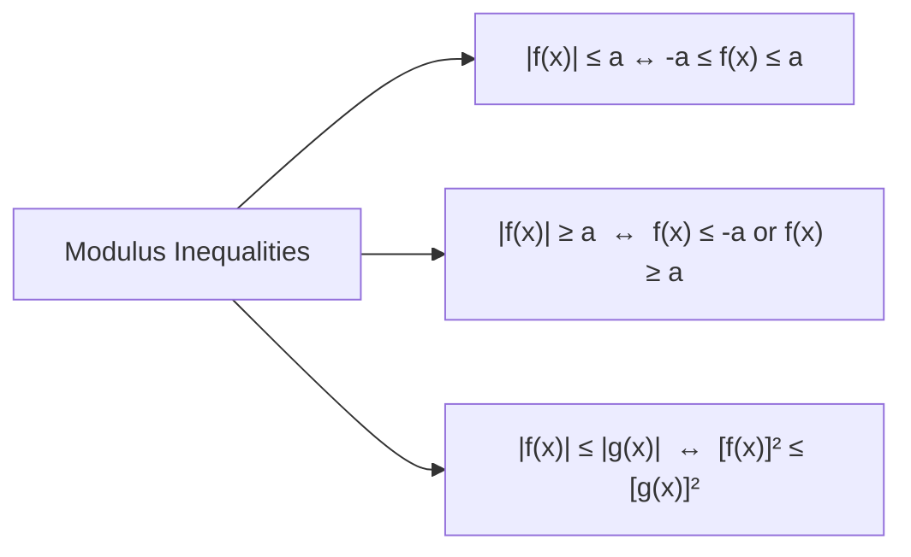

# Lesson 01: Real Numbers, Inequalities & Absolute Values

> [!ABSTRACT] Syllabus Scope (NIE Teacher’s Guide)
> - Real Number System ($\mathbb{N} \subset \mathbb{Z} \subset \mathbb{Q} \subset \mathbb{R}$) & Surds
> - Laws of Indices & Laws of Logarithms ($\log_b (x y) = \log_b x + \log_b y, \log_b x = \frac{\log_a x}{\log_a b}$)
> - Axioms & Basic Properties of Real Inequalities
> - Solving Rational Inequalities via Sign Diagram / Number Line Method
> - Modulus / Absolute Value Function ($|x|$) & Modulus Inequalities ($|x| \le a \iff -a \le x \le a, |x| \ge a \iff x \le -a \text{ or } x \ge a, |x|^2 = x^2$)

---
## 1. Laws of Logarithms & Indices

For $a, b > 0$ and $a, b \ne 1$:
1. $\log_a (x y) = \log_a x + \log_a y$
2. $\log_a \left(\frac{x}{y}\right) = \log_a x - \log_a y$
3. $\log_a (x^k) = k \log_a x$
4. **Change of Base Formula**: $\log_b x = \frac{\log_a x}{\log_a b}$
5. $\log_a b \cdot \log_b a = 1 \implies \log_b a = \frac{1}{\log_a b}$

---
## 2. Rational Inequalities & Sign Diagram Method

> [!IMPORTANT] Rule for Solving Rational Inequalities
> Never cross-multiply by an expression involving $x$ unless its sign is guaranteed to be strictly positive! Instead:
> 1. Move all terms to one side so the inequality becomes $\frac{P(x)}{Q(x)} \ge 0$ (or $\le 0$).
> 2. Factorize numerator $P(x)$ and denominator $Q(x)$ into linear/quadratic factors.
> 3. Determine critical points where factors equal zero and construct a **Number Line Sign Diagram**.

---
## 3. Absolute Value (Modulus) Properties

Definition:
$$|x| = \begin{cases} x & \text{if } x \ge 0 \\ -x & \text{if } x < 0 \end{cases}$$

Key Properties:
- $|x| \ge 0$ for all $x \in \mathbb{R}$.
- $|x|^2 = x^2$.
- $|a b| = |a| \cdot |b|$ and $\left|\frac{a}{b}\right| = \frac{|a|}{|b|}$.
- **Triangle Inequality**: $|a + b| \le |a| + |b|$.

---
## :LiRocket: Flashcards (Spaced Repetition)

#flashcards

State the change of base formula for logarithms. :: $\log_b x = \frac{\log_a x}{\log_a b}$.

What is the golden rule when solving algebraic inequalities involving fractions? :: Never cross-multiply by an expression containing the variable unless its sign is known to be strictly positive; bring all terms to one side and use a sign diagram.

What is the equivalent algebraic condition for $|f(x)| \le a$ (where $a > 0$)? :: $-a \le f(x) \le a$.

What is the equivalent algebraic condition for $|f(x)| \ge a$ (where $a > 0$)? :: $f(x) \le -a$ or $f(x) \ge a$.

How can an inequality of the form $|f(x)| \le |g(x)|$ be solved efficiently without case splitting? :: By squaring both sides: $[f(x)]^2 \le [g(x)]^2 \iff [f(x)]^2 - [g(x)]^2 \le 0 \iff (f(x)-g(x))(f(x)+g(x)) \le 0$.

State the Triangle Inequality for real numbers. :: $|a + b| \le |a| + |b|$.