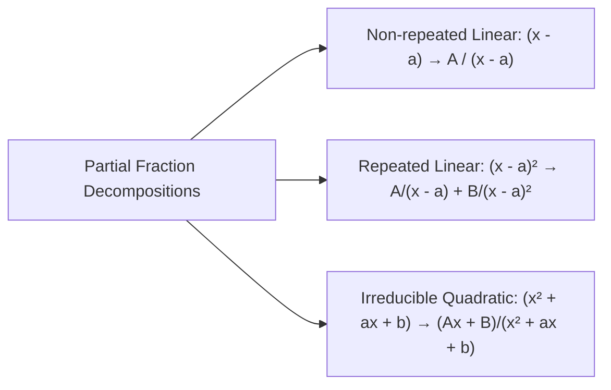

# Lesson 02: Polynomials, Remainder Theorem & Partial Fractions

> [!ABSTRACT] Syllabus Scope (NIE Teacher's Guide)
> - Polynomial Definition $P(x) = a_n x^n + a_{n-1} x^{n-1} + \dots + a_1 x + a_0$ & Degree
> - Polynomial Equality & Equating Coefficients
> - Division Algorithm: $P(x) = Q(x) D(x) + R(x)$ where $\deg(R) < \deg(D)$
> - **Remainder Theorem**: If polynomial $P(x)$ is divided by $(x - a)$, the remainder is $P(a)$.
> - **Factor Theorem**: $(x - a)$ is a factor of $P(x) \iff P(a) = 0$.
> - Resolving Rational Functions $\frac{P(x)}{Q(x)}$ into **Partial Fractions** (Linear, Repeated Linear, Quadratic factors).

---
## 1. Remainder Theorem & Factor Theorem

> [!KEY-CONCEPT] Remainder & Factor Theorems
> - **Remainder Theorem**: When a polynomial $P(x)$ is divided by $(ax - b)$, the remainder is $R = P\left(\frac{b}{a}\right)$.
> - **Extended Remainder Theorem**: When $P(x)$ is divided by $(x-a)(x-b)$, the remainder is a linear polynomial $R(x) = A x + B$.
> - **Factor Theorem**: $(ax - b)$ is a factor of $P(x)$ if and only if $P\left(\frac{b}{a}\right) = 0$.

---
## 2. Resolving into Partial Fractions

A rational function $\frac{P(x)}{Q(x)}$ is **Proper** if $\deg(P) < \deg(Q)$. If $\deg(P) \ge \deg(Q)$, perform polynomial long division first!

---
## :LiRocket: Flashcards (Spaced Repetition)

#flashcards

State the Remainder Theorem for a polynomial $P(x)$ divided by $(ax - b)$. :: The remainder is $R = P\left(\frac{b}{a}\right)$.

State the Factor Theorem. :: $(ax - b)$ is a factor of polynomial $P(x)$ if and only if $P\left(\frac{b}{a}\right) = 0$.

What is the general form of the remainder when a polynomial $P(x)$ is divided by a quadratic expression $(x - a)(x - b)$? :: A linear expression $R(x) = A x + B$.

What must be done before resolving a rational fraction $\frac{P(x)}{Q(x)}$ into partial fractions if $\deg(P) \ge \deg(Q)$? :: Perform polynomial long division to express it as a polynomial plus a proper rational fraction $\frac{R(x)}{Q(x)}$.

What is the partial fraction template for a repeated linear factor $(x - a)^2$ in the denominator? :: $\frac{A}{x - a} + \frac{B}{(x - a)^2}$.

What is the partial fraction template for an irreducible quadratic factor $(x^2 + px + q)$ in the denominator? :: $\frac{A x + B}{x^2 + px + q}$.