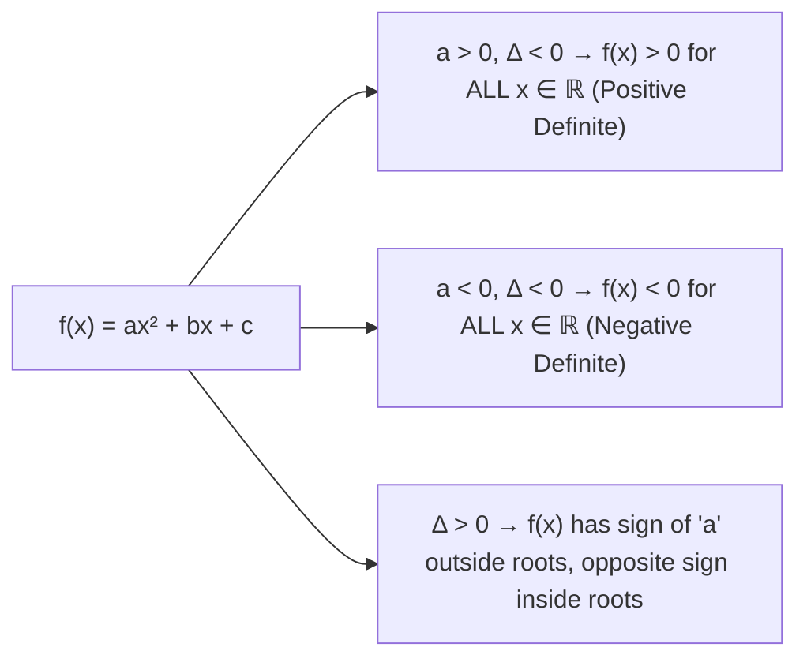

# :LiBook: Lesson 03: Quadratic Functions & Equations

> [!ABSTRACT] Syllabus Scope (NIE Teacher's Guide)
> - Quadratic Equation $a x^2 + b x + c = 0$ ($a \neq 0$) & Quadratic Formula $x = \frac{-b \pm \sqrt{b^2 - 4ac}}{2a}$
> - **Discriminant ($\Delta = b^2 - 4ac$)**:
>   - $\Delta > 0 \iff$ Two distinct real roots.
>   - $\Delta = 0 \iff$ Two equal real roots (repeating root).
>   - $\Delta < 0 \iff$ Complex conjugate roots (no real roots).
> - **Relations between Roots & Coefficients**: $\alpha + \beta = -\frac{b}{a}$, $\alpha \beta = \frac{c}{a}$.
> - Symmetric functions of roots ($\alpha^2 + \beta^2 = (\alpha+\beta)^2 - 2\alpha\beta$, $\alpha^3 + \beta^3 = (\alpha+\beta)^3 - 3\alpha\beta(\alpha+\beta)$).
> - Forming quadratic equation with roots $\alpha', \beta'$: $x^2 - (\text{Sum of roots}) x + (\text{Product of roots}) = 0$.
> - Quadratic Graph $y = a x^2 + b x + c$: Vertex at $\left(-\frac{b}{2a}, -\frac{\Delta}{4a}\right)$. Sign of quadratic expression.

---
## 1. Roots & Coefficients Relations

For $a x^2 + b x + c = 0$ with roots $\alpha, \beta$:
$$\alpha + \beta = -\frac{b}{a}, \quad \alpha \beta = \frac{c}{a}$$

### Common Symmetric Expressions:
1. $\alpha^2 + \beta^2 = (\alpha + \beta)^2 - 2\alpha\beta$
2. $(\alpha - \beta)^2 = (\alpha + \beta)^2 - 4\alpha\beta \implies |\alpha - \beta| = \frac{\sqrt{\Delta}}{|a|}$
3. $\alpha^3 + \beta^3 = (\alpha + \beta)^3 - 3\alpha\beta(\alpha + \beta)$
4. $\frac{1}{\alpha} + \frac{1}{\beta} = \frac{\alpha + \beta}{\alpha \beta}$

---
## 2. Sign of Quadratic Expression $f(x) = a x^2 + b x + c$

---
## :LiRocket: Flashcards (Spaced Repetition)

#flashcards

State the relations between roots $\alpha, \beta$ and coefficients of $ax^2 + bx + c = 0$. :: $\alpha + \beta = -\frac{b}{a}$ and $\alpha \beta = \frac{c}{a}$.

What is the expression for $\alpha^2 + \beta^2$ in terms of $(\alpha + \beta)$ and $\alpha \beta$? :: $\alpha^2 + \beta^2 = (\alpha + \beta)^2 - 2\alpha\beta$.

What is the condition for $a x^2 + b x + c > 0$ to hold for all real values of $x$? :: $a > 0$ and Discriminant $\Delta = b^2 - 4ac < 0$ (Positive Definite).

What is the condition for $a x^2 + b x + c < 0$ to hold for all real values of $x$? :: $a < 0$ and Discriminant $\Delta = b^2 - 4ac < 0$ (Negative Definite).

How do you form a quadratic equation whose roots are $x_1$ and $x_2$? :: $x^2 - (x_1 + x_2) x + (x_1 x_2) = 0$.