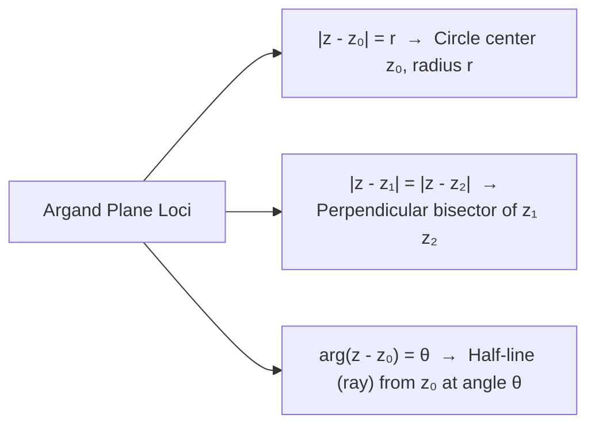

# :LiBook: Lesson 04: Complex Numbers

> [!ABSTRACT] Syllabus Scope (NIE Teacher's Guide)
> - Imaginary Unit $i = \sqrt{-1}$ ($i^2 = -1, i^3 = -i, i^4 = 1$)
> - Cartesian Form $z = x + i y$ ($x = \text{Re}(z), y = \text{Im}(z)$) & Complex Conjugate $\bar{z} = x - i y$
> - Modulus $|z| = \sqrt{x^2 + y^2}$ & Argument $\arg(z) = \theta = \tan^{-1}\left(\frac{y}{x}\right)$ (Principal Argument $-\pi < \text{Arg}(z) \le \pi$)
> - Polar Form $z = r (\cos\theta + i\sin\theta)$ & Exponential Form $z = r e^{i\theta}$
> - **De Moivre's Theorem**: $(\cos\theta + i\sin\theta)^n = \cos(n\theta) + i\sin(n\theta)$ for all $n \in \mathbb{Z}$
> - Loci in Argand Diagram ($|z - z_0| = r$, $|z - z_1| = |z - z_2|$, $\arg(z - z_0) = \theta$)

---
## 1. Complex Algebra & Conjugate Properties

For $z = x + i y$ and $\bar{z} = x - i y$:
1. $z + \bar{z} = 2x = 2 \text{Re}(z)$
2. $z - \bar{z} = 2i y = 2i \text{Im}(z)$
3. $z \cdot \bar{z} = x^2 + y^2 = |z|^2$
4. $\overline{z_1 \pm z_2} = \bar{z}_1 \pm \bar{z}_2, \quad \overline{z_1 z_2} = \bar{z}_1 \bar{z}_2, \quad \overline{\left(\frac{z_1}{z_2}\right)} = \frac{\bar{z}_1}{\bar{z}_2}$
5. $|z_1 z_2| = |z_1| \cdot |z_2|, \quad \left|\frac{z_1}{z_2}\right| = \frac{|z_1|}{|z_2|}$
6. $\arg(z_1 z_2) = \arg(z_1) + \arg(z_2), \quad \arg\left(\frac{z_1}{z_2}\right) = \arg(z_1) - \arg(z_2)$

---
## 2. Loci in the Argand Plane

> [!INFO] Deep Dive Note
> For complete geometrical derivations of Argand loci, roots of unity ($z^n = 1$), and De Moivre applications, read: [[Subtopics/Complex Numbers & Argand Diagrams|Complex Numbers & Argand Diagrams Guide]].

---
## :LiRocket: Flashcards (Spaced Repetition)

#flashcards

What is the relationship between a complex number $z$ and its conjugate $\bar{z}$ regarding modulus? :: $z \cdot \bar{z} = |z|^2$.

State De Moivre's Theorem for an integer $n$. :: $(\cos\theta + i\sin\theta)^n = \cos(n\theta) + i\sin(n\theta)$.
<!--SR:!2026-09-26,1,230-->

What is the range of the Principal Argument $\text{Arg}(z)$ of a complex number? :: $-\pi < \text{Arg}(z) \le \pi$.
<!--SR:!2026-09-26,1,230-->

Geometrically describe the locus given by $|z - z_0| = r$. :: A circle with center at complex point $z_0$ and radius $r$.

Geometrically describe the locus given by $|z - z_1| = |z - z_2|$. :: The perpendicular bisector of the line segment joining complex points $z_1$ and $z_2$.
<!--SR:!2026-09-26,1,230-->