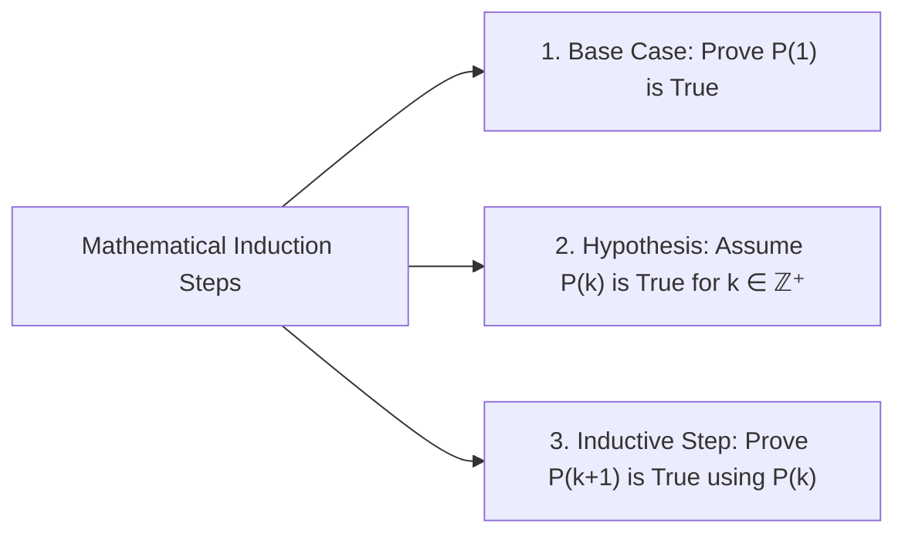

# Lesson 05: Sequences, Series & Mathematical Induction

> [!ABSTRACT] Syllabus Scope (NIE Teacher's Guide)
> - Arithmetic Progression (AP): $T_n = a + (n-1)d$, $S_n = \frac{n}{2}[2a + (n-1)d] = \frac{n}{2}(a + l)$
> - Geometric Progression (GP): $T_n = a r^{n-1}$, $S_n = \frac{a(1 - r^n)}{1 - r}$, Sum to Infinity $S_\infty = \frac{a}{1 - r}$ ($|r| < 1$)
> - Sigma ($\sum$) Notation & Properties: $\sum_{r=1}^n 1 = n, \sum_{r=1}^n r = \frac{n(n+1)}{2}, \sum_{r=1}^n r^2 = \frac{n(n+1)(2n+1)}{6}, \sum_{r=1}^n r^3 = \left[\frac{n(n+1)}{2}\right]^2$
> - **Method of Differences**: $U_r = V_r - V_{r+1} \implies \sum_{r=1}^n U_r = V_1 - V_{n+1}$
> - **Principle of Mathematical Induction**: 3-step proof (Base step $n=1$, Inductive hypothesis $n=k$, Inductive step $n=k+1$).

---
## 1. Standard Summation Formulas

1. $\sum_{r=1}^n r = \frac{n(n+1)}{2}$
2. $\sum_{r=1}^n r^2 = \frac{n(n+1)(2n+1)}{6}$
3. $\sum_{r=1}^n r^3 = \frac{n^2(n+1)^2}{4} = \left(\sum_{r=1}^n r\right)^2$

---
## 2. Method of Differences & Mathematical Induction

- **Method of Differences**: Express $U_r = V_r - V_{r+1}$ or $V_{r+1} - V_r$. Summing telescopically yields:
  $$\sum_{r=1}^n U_r = (V_1 - V_2) + (V_2 - V_3) + \dots + (V_n - V_{n+1}) = V_1 - V_{n+1}$$

---
## :LiRocket: Flashcards (Spaced Repetition)

#flashcards

State the formula for the sum of an infinite Geometric Series ($S_\infty$). :: $S_\infty = \frac{a}{1 - r}$ (valid only when $|r| < 1$).

State the standard formula for $\sum_{r=1}^n r^2$. :: $\sum_{r=1}^n r^2 = \frac{n(n+1)(2n+1)}{6}$.

State the standard formula for $\sum_{r=1}^n r^3$. :: $\sum_{r=1}^n r^3 = \left[\frac{n(n+1)}{2}\right]^2$.

What is the telescoping sum result for $\sum_{r=1}^n (V_r - V_{r+1})$? :: $V_1 - V_{n+1}$.

What are the 3 steps of a Proof by Mathematical Induction? :: 1. Base Step (verify $P(1)$ is true), 2. Inductive Hypothesis (assume $P(k)$ is true for integer $k \ge 1$), 3. Inductive Step (prove $P(k+1)$ is true).