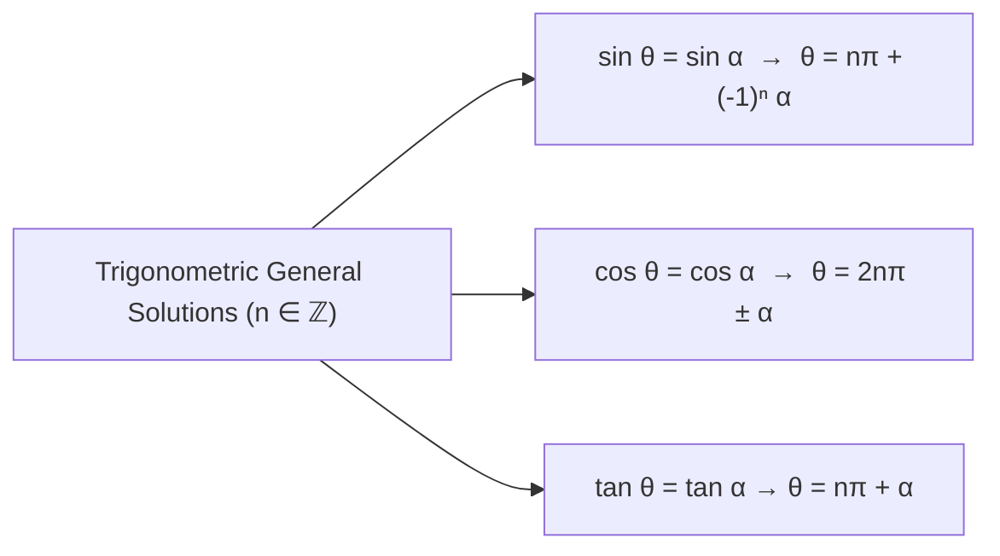

# Lesson 07: Trigonometric Functions, Identities & Equations

> [!ABSTRACT] Syllabus Scope (NIE Teacher's Guide)
> - Radian Measure ($180^\circ = \pi \text{ rad}$), Arc Length $s = r\theta$, Sector Area $A = \frac{1}{2}r^2\theta$
> - Pythagorean Identities ($\sin^2\theta + \cos^2\theta = 1, 1 + \tan^2\theta = \sec^2\theta, 1 + \cot^2\theta = \csc^2\theta$)
> - Compound Angle Formulas ($\sin(A \pm B), \cos(A \pm B), \tan(A \pm B)$)
> - Double & Triple Angle Formulas ($\sin 2A, \cos 2A, \tan 2A, \sin 3A, \cos 3A$)
> - Product-to-Sum & Sum-to-Product Identities
> - **General Solutions of Trigonometric Equations**:
>   - $\sin\theta = \sin\alpha \implies \theta = n\pi + (-1)^n \alpha \quad (n \in \mathbb{Z})$
>   - $\cos\theta = \cos\alpha \implies \theta = 2n\pi \pm \alpha \quad (n \in \mathbb{Z})$
>   - $\tan\theta = \tan\alpha \implies \theta = n\pi + \alpha \quad (n \in \mathbb{Z})$
> - **Triangle Rules**: Sine Rule ($\frac{a}{\sin A} = \frac{b}{\sin B} = \frac{c}{\sin C} = 2R$), Cosine Rule ($a^2 = b^2 + c^2 - 2bc \cos A$), Area of Triangle ($\frac{1}{2}bc\sin A$).

---
## 1. Compound & Double Angle Identities

1. $\sin(A \pm B) = \sin A \cos B \pm \cos A \sin B$
2. $\cos(A \pm B) = \cos A \cos B \mp \sin A \sin B$
3. $\tan(A \pm B) = \frac{\tan A \pm \tan B}{1 \mp \tan A \tan B}$
4. $\sin 2A = 2\sin A \cos A = \frac{2\tan A}{1 + \tan^2 A}$
5. $\cos 2A = \cos^2 A - \sin^2 A = 2\cos^2 A - 1 = 1 - 2\sin^2 A = \frac{1 - \tan^2 A}{1 + \tan^2 A}$
6. $\tan 2A = \frac{2\tan A}{1 - \tan^2 A}$

---
## 2. General Solutions of Trigonometric Equations

---
## :LiRocket: Flashcards (Spaced Repetition)

#flashcards

State the general solution of $\sin\theta = \sin\alpha$. :: $\theta = n\pi + (-1)^n \alpha \quad (n \in \mathbb{Z})$.

State the general solution of $\cos\theta = \cos\alpha$. :: $\theta = 2n\pi \pm \alpha \quad (n \in \mathbb{Z})$.

State the general solution of $\tan\theta = \tan\alpha$. :: $\theta = n\pi + \alpha \quad (n \in \mathbb{Z})$.

State the 3 forms of the $\cos 2A$ identity. :: $\cos 2A = \cos^2 A - \sin^2 A = 2\cos^2 A - 1 = 1 - 2\sin^2 A$.

State the Sine Rule for a triangle $ABC$ with circumradius $R$. :: $\frac{a}{\sin A} = \frac{b}{\sin B} = \frac{c}{\sin C} = 2R$.

State the Cosine Rule for side $a$ of triangle $ABC$. :: $a^2 = b^2 + c^2 - 2bc \cos A$.