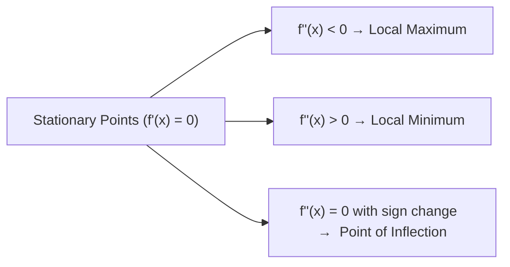

# :LiBook: Lesson 08: Differential Calculus & Applications

> [!ABSTRACT] Syllabus Scope (NIE Teacher's Guide)
> - Limits & Continuity: Standard limits $\lim_{x \to 0} \frac{\sin x}{x} = 1, \lim_{x \to a} \frac{x^n - a^n}{x - a} = n a^{n-1}$
> - Definition of Derivative from First Principles: $f'(x) = \lim_{h \to 0} \frac{f(x+h) - f(x)}{h}$
> - Differentiation Rules: Product Rule, Quotient Rule, Chain Rule
> - Derivatives of Standard Functions: $x^n, \sin x, \cos x, \tan x, e^x, a^x, \ln x$
> - Implicit Differentiation & Parametric Differentiation ($\frac{dy}{dx} = \frac{dy/dt}{dx/dt}$)
> - Applications: Tangents & Normals, Stationary Points ($f'(x) = 0$), First & Second Derivative Tests, Concavity ($f''(x) > 0 \implies \text{concave up}$), Points of Inflection ($f''(x) = 0$ with sign change), Optimization & Curve Sketching

---
## 1. Derivative Rules & Standard Derivatives

1. **Product Rule**: $\frac{d}{dx}[u v] = u \frac{dv}{dx} + v \frac{du}{dx}$
2. **Quotient Rule**: $\frac{d}{dx}\left[\frac{u}{v}\right] = \frac{v \frac{du}{dx} - u \frac{dv}{dx}}{v^2}$
3. **Chain Rule**: $\frac{dy}{dx} = \frac{dy}{du} \cdot \frac{du}{dx}$
4. **Parametric Rule**: $\frac{dy}{dx} = \frac{dy/dt}{dx/dt}, \quad \frac{d^2 y}{dx^2} = \frac{\frac{d}{dt}\left(\frac{dy}{dx}\right)}{\frac{dx}{dt}}$

| Function $f(x)$ | Derivative $f'(x)$ |
| :--- | :--- |
| $x^n$ | $n x^{n-1}$ |
| $e^{k x}$ | $k e^{k x}$ |
| $\ln x$ | $\frac{1}{x}$ |
| $\sin(kx)$ | $k \cos(kx)$ |
| $\cos(kx)$ | $-k \sin(kx)$ |
| $\tan(kx)$ | $k \sec^2(kx)$ |

---
## 2. Stationary Points & Curve Sketching

---
## 3. Derivatives of Inverse Trig Functions by Substitution

> **Core Idea**: Simplify the argument of $\sin^{-1}$, $\cos^{-1}$, $\tan^{-1}$ using trig substitution so the inverse cancels.

### 3.1 Standard Substitution Patterns

| Argument Form | Substitution | Simplified Radical | Resulting Angle |
|---------------|--------------|-------------------|-----------------|
| $\sqrt{a^2 - x^2}$ | $x = a\sin\theta$ | $a\cos\theta$ | $\theta$ |
| $\sqrt{a^2 + x^2}$ | $x = a\tan\theta$ | $a\sec\theta$ | $\theta$ or $\frac{\theta}{2}$ |
| $\sqrt{x^2 - a^2}$ | $x = a\sec\theta$ | $a\tan\theta$ | $\theta$ |
| $\frac{a-x}{a+x}$, $\sqrt{\frac{a-x}{a+x}}$ | $x = a\cos 2\theta$ | $\tan\theta$ or $\cot\theta$ | $\theta$ |
| $\frac{2x}{1+x^2}$ | $x = \tan\theta$ | $\sin 2\theta$ | $2\theta$ |
| $\frac{1-x^2}{1+x^2}$ | $x = \tan\theta$ | $\cos 2\theta$ | $2\theta$ |
| $\frac{2x}{1-x^2}$ | $x = \tan\theta$ | $\tan 2\theta$ | $2\theta$ |

### 3.2 Key Half-Angle Identities (Memorise)

$$
\frac{1 - \cos\theta}{\sin\theta} = \tan\frac{\theta}{2},\quad
\frac{\sin\theta}{1 + \cos\theta} = \tan\frac{\theta}{2},\quad
\sqrt{\frac{1 - \cos\theta}{1 + \cos\theta}} = \tan\frac{\theta}{2}
$$

$$
\frac{\sec\theta - 1}{\tan\theta} = \tan\frac{\theta}{2},\quad
\sqrt{\frac{\sec\theta - 1}{\sec\theta + 1}} = \tan\frac{\theta}{2}
$$

### 3.3 Worked Examples

#### Example 1: $y = \tan^{-1}\left(\frac{\sqrt{1+x^2} - 1}{x}\right)$

**Method A: $x = \tan\theta$**
$$
\sqrt{1+x^2} = \sec\theta
\implies \frac{\sec\theta - 1}{\tan\theta} = \tan\frac{\theta}{2}
\implies y = \frac{\theta}{2} = \frac{1}{2}\tan^{-1}x
\implies \frac{dy}{dx} = \frac{1}{2(1+x^2)}
$$

**Method B: $\sqrt{1+x^2} = t$**
$$
t = \sqrt{1+x^2} \implies x = \sqrt{t^2-1}
\implies \frac{t-1}{\sqrt{t^2-1}} = \sqrt{\frac{t-1}{t+1}} = \tan\phi
\implies t = \sec 2\phi = \sec\theta \implies \phi = \frac{\theta}{2}
$$
Same result: $\frac{dy}{dx} = \frac{1}{2(1+x^2)}$.

#### Example 2: $y = \sin^{-1}\left(\frac{2x}{1+x^2}\right)$

Let $x = \tan\theta$:
$$
\frac{2\tan\theta}{1+\tan^2\theta} = 2\sin\theta\cos\theta = \sin 2\theta
\implies y = \sin^{-1}(\sin 2\theta)
$$
**Range check**: $x \in \mathbb{R} \Rightarrow \theta \in (-\pi/2, \pi/2) \Rightarrow 2\theta \in (-\pi, \pi)$
Principal range of $\sin^{-1}$ is $[-\pi/2, \pi/2]$:
$$
y = \begin{cases}
2\theta = 2\tan^{-1}x, & |x| \le 1 \\
\pi - 2\theta = \pi - 2\tan^{-1}x, & x > 1 \\
-\pi - 2\theta = -\pi - 2\tan^{-1}x, & x < -1
\end{cases}
$$
$$
\frac{dy}{dx} = \begin{cases}
\frac{2}{1+x^2}, & |x| < 1 \\
-\frac{2}{1+x^2}, & |x| > 1
\end{cases}
$$

#### Example 3: $y = \cos^{-1}\left(\frac{1-x^2}{1+x^2}\right)$

Let $x = \tan\theta$:
$$
\frac{1-\tan^2\theta}{1+\tan^2\theta} = \cos 2\theta
\implies y = \cos^{-1}(\cos 2\theta)
$$
Range: $2\theta \in (-\pi, \pi)$, principal range of $\cos^{-1}$ is $[0, \pi]$:
$$
y = \begin{cases}
2\theta = 2\tan^{-1}x, & x \ge 0 \\
-2\theta = -2\tan^{-1}x, & x < 0
\end{cases}
\implies
\frac{dy}{dx} = \begin{cases}
\frac{2}{1+x^2}, & x > 0 \\
-\frac{2}{1+x^2}, & x < 0
\end{cases}
$$

#### Example 4: $y = \tan^{-1}\left(\sqrt{\frac{a-x}{a+x}}\right)$

Let $x = a\cos 2\theta$:
$$
\sqrt{\frac{a - a\cos 2\theta}{a + a\cos 2\theta}}
= \sqrt{\frac{1-\cos 2\theta}{1+\cos 2\theta}}
= \sqrt{\frac{2\sin^2\theta}{2\cos^2\theta}} = \tan\theta
\implies y = \theta = \frac{1}{2}\cos^{-1}\left(\frac{x}{a}\right)
$$
$$
\frac{dy}{dx} = -\frac{1}{2\sqrt{a^2 - x^2}}
$$

### 3.4 General Procedure

1. **Identify** the algebraic form inside the inverse trig function.
2. **Choose** the appropriate substitution (see table above).
3. **Substitute** and simplify using trig identities.
4. **Apply** inverse function cancellation — **check principal range**!
5. **Back-substitute** to express $y$ in terms of $x$.
6. **Differentiate** the simplified expression.

---
## :LiRocket: Flashcards (Spaced Repetition)

#flashcards

State the standard limit $\lim_{x \to 0} \frac{\sin x}{x}$. :: $1$.

State the Quotient Rule for differentiation $\frac{d}{dx}\left[\frac{u}{v}\right]$. :: $\frac{v u' - u v'}{v^2}$.

What is the second derivative formula for parametric equations $x = f(t), y = g(t)$? :: $\frac{d^2 y}{dx^2} = \frac{\frac{d}{dt}\left(\frac{dy}{dx}\right)}{\frac{dx}{dt}}$.

How do you test if a stationary point ($f'(x_0) = 0$) is a local minimum or local maximum using the second derivative test? :: If $f''(x_0) > 0$, it is a local minimum; if $f''(x_0) < 0$, it is a local maximum.

What is the slope of the normal to a curve $y = f(x)$ at point $(x_0, y_0)$ where $f'(x_0) \ne 0$? :: $m_{normal} = -\frac{1}{f'(x_0)}$.

---
## 3.5 Substitution Flashcards

#flashcards

What substitution simplifies $\sqrt{a^2 - x^2}$? :: $x = a\sin\theta$ (or $a\cos\theta$).

What substitution simplifies $\sqrt{a^2 + x^2}$? :: $x = a\tan\theta$.

What substitution simplifies $\sqrt{x^2 - a^2}$? :: $x = a\sec\theta$.

What substitution simplifies $\frac{2x}{1+x^2}$? :: $x = \tan\theta$ (gives $\sin 2\theta$).

What substitution simplifies $\frac{1-x^2}{1+x^2}$? :: $x = \tan\theta$ (gives $\cos 2\theta$).

What substitution simplifies $\frac{2x}{1-x^2}$? :: $x = \tan\theta$ (gives $\tan 2\theta$).

What substitution simplifies $\sqrt{\frac{a-x}{a+x}}$? :: $x = a\cos 2\theta$ (gives $\tan\theta$).

State the half-angle identity for $\frac{1-\cos\theta}{\sin\theta}$. :: $\tan\frac{\theta}{2}$.

State the half-angle identity for $\frac{\sin\theta}{1+\cos\theta}$. :: $\tan\frac{\theta}{2}$.

State the half-angle identity for $\sqrt{\frac{1-\cos\theta}{1+\cos\theta}}$. :: $\tan\frac{\theta}{2}$.

What is the derivative of $y = \tan^{-1}\left(\frac{\sqrt{1+x^2}-1}{x}\right)$? :: $\frac{1}{2(1+x^2)}$.

What is the derivative of $y = \sin^{-1}\left(\frac{2x}{1+x^2}\right)$ for $|x| < 1$? :: $\frac{2}{1+x^2}$.

What is the derivative of $y = \cos^{-1}\left(\frac{1-x^2}{1+x^2}\right)$ for $x > 0$? :: $\frac{2}{1+x^2}$.

Why must you check the principal range after substitution? :: The inverse trig function only cancels if the angle lies in its principal range; otherwise piecewise definitions with $\pi$ adjustments are needed.