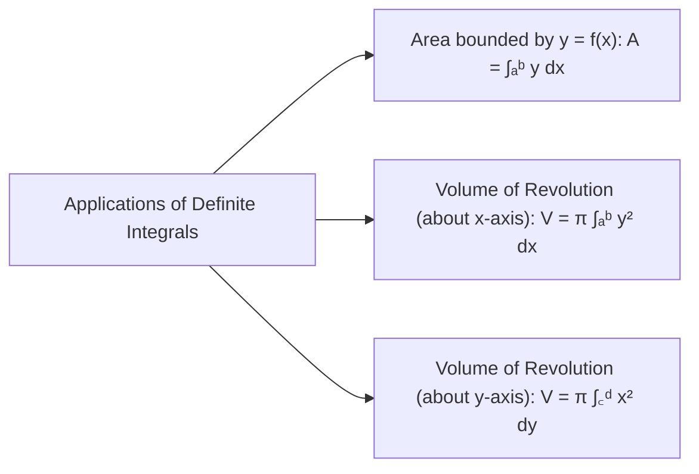

# :LiBook: Lesson 09: Integral Calculus & Applications

> [!ABSTRACT] Syllabus Scope (NIE Teacher's Guide)
> - Indefinite Integral as Anti-derivative: $\int f(x) dx = F(x) + C$
> - Standard Integrals: $\int x^n dx = \frac{x^{n+1}}{n+1} + C$, $\int \frac{1}{x} dx = \ln|x| + C$, $\int e^{kx} dx = \frac{1}{k}e^{kx} + C$
> - Integration Methods:
>   - **Substitution Method**: $\int f(g(x)) g'(x) dx = \int f(u) du$
>   - **Trigonometric Substitutions & Identities**
>   - **Partial Fractions Integration**: $\int \frac{P(x)}{Q(x)} dx$
>   - **Integration by Parts**: $\int u \, dv = u v - \int v \, du$ (or $\int u v' dx = u v - \int u' v dx$)
> - **Definite Integrals & Fundamental Theorem of Calculus**: $\int_a^b f(x) dx = F(b) - F(a)$
> - Applications: Area under curves $A = \int_a^b y dx$, Volume of Revolution $V_x = \pi \int_a^b y^2 dx$ (about x-axis) and $V_y = \pi \int_c^d x^2 dy$ (about y-axis).

---
## 1. Key Integration Techniques

### A. Integration by Parts:
$$\int u \, dv = u v - \int v \, du$$
Choose $u$ using the **LIATE** rule (Logarithmic, Inverse trig, Algebraic, Trigonometric, Exponential).

### B. Standard Integrals:
1. $\int \frac{1}{a^2 + x^2} dx = \frac{1}{a} \tan^{-1}\left(\frac{x}{a}\right) + C$
2. $\int \frac{1}{\sqrt{a^2 - x^2}} dx = \sin^{-1}\left(\frac{x}{a}\right) + C$
3. $\int \frac{f'(x)}{f(x)} dx = \ln|f(x)| + C$

---
## 2. Area & Volume of Revolution

---
## :LiRocket: Flashcards (Spaced Repetition)

#flashcards

State the Integration by Parts formula. :: $\int u \, dv = u v - \int v \, du$.

What is the result of $\int \frac{f'(x)}{f(x)} dx$? :: $\ln|f(x)| + C$.

What is the integral $\int \frac{1}{a^2 + x^2} dx$? :: $\frac{1}{a} \tan^{-1}\left(\frac{x}{a}\right) + C$.

What is the formula for the Area bounded by curve $y = f(x)$, $x$-axis, and vertical lines $x = a, x = b$? :: $A = \int_a^b y \, dx$.

What is the formula for the Volume of Revolution generated by rotating curve $y = f(x)$ about the $x$-axis from $x = a$ to $x = b$? :: $V = \pi \int_a^b y^2 \, dx$.