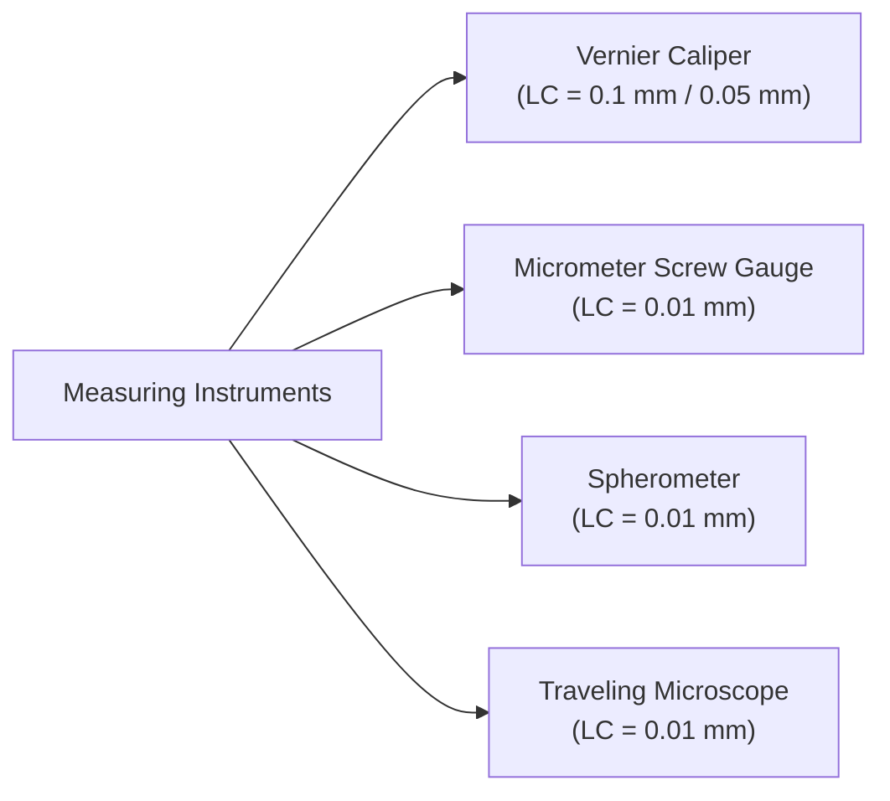

# :LiBook: Lesson 01: Measurements & Units

> [!ABSTRACT] Syllabus Scope (NIE Teacher's Guide)
> - Base & Derived SI Units, SI Prefixes
> - Dimensional Analysis & Homogeneity
> - Errors in Measurement (Random vs Systemic, Least Count)
> - Fractional & Percentage Uncertainties & Error Propagation Rules
> - Measuring Instruments: Vernier Caliper, Micrometer Screw Gauge, Spherometer, Traveling Microscope, Mass Balance

---
## 1. SI Units & Dimensions

### Base SI Units:
| Quantity | Base Unit | Symbol | Dimension Symbol |
| :--- | :--- | :---: | :---: |
| Mass | kilogram | kg | $\mathsf{M}$ |
| Length | meter | m | $\mathsf{L}$ |
| Time | second | s | $\mathsf{T}$ |
| Electric Current | ampere | A | $\mathsf{I}$ |
| Temperature | kelvin | K | $\Theta$ |
| Amount of Substance | mole | mol | $\mathsf{N}$ |
| Luminous Intensity | candela | cd | $\mathsf{J}$ |

### Dimensional Homogeneity:
In any physically valid equation $Y = A + B$, every additive term must have the **exact same dimensions**.
- Dimensional analysis is used to:
  1. Check correctness of physical equations.
  2. Derive relationships between physical quantities.
  3. Determine units of unknown constants (e.g., Gravitational constant $G = [\mathsf{M}^{-1}\mathsf{L}^3\mathsf{T}^{-2}]$).

---
## 2. Errors & Uncertainty Analysis

- **Systematic Errors**: Errors that shift readings in one direction consistently (e.g., zero errors, incorrect calibration). Can be eliminated by calibration or correction.
- **Random Errors**: Unpredictable variations due to environmental changes or human parallax. Reduced by taking multiple readings and calculating the mean.

### Fractional & Percentage Uncertainty:
For a measurement $x \pm \Delta x$:
$$\text{Fractional Uncertainty} = \frac{\Delta x}{x}, \quad \text{Percentage Uncertainty} = \left(\frac{\Delta x}{x}\right) \times 100\%$$

> [!note] Error Propagation Rules
> 1. **Addition & Subtraction** ($Z = A \pm B$):
>    $$\Delta Z = \Delta A + \Delta B$$
> 2. **Multiplication & Division** ($Z = A \cdot B$ or $A / B$):
>    $$\frac{\Delta Z}{Z} = \frac{\Delta A}{A} + \frac{\Delta B}{B}$$
> 3. **Powers** ($Z = A^n \cdot B^m$):
>    $$\frac{\Delta Z}{Z} = n \left(\frac{\Delta A}{A}\right) + m \left(\frac{\Delta B}{B}\right)$$

---
## 3. Core Measuring Instruments

> [!INFO] Deep Dive Note
> For zero error corrections, practical setup, and spherometer curvature calculations, read: [[Subtopics/Errors & Measuring Instruments|Errors & Measuring Instruments Guide]].

---
## :LiRocket: Flashcards (Spaced Repetition)

#flashcards
  
What are the 7 SI base quantities? :: Mass (kg), Length (m), Time (s), Electric Current (A), Temperature (K), Amount of Substance (mol), Luminous Intensity (cd).

What is the principle of dimensional homogeneity? :: In any physically valid equation, all terms added or subtracted must have identical dimensions.
<!--SR:!2026-09-26,1,230-->

What is the difference between systematic errors and random errors? :: Systematic errors consistently bias readings in one direction and can be corrected; Random errors cause unpredictable scatter and are reduced by taking repeated average readings.
<!--SR:!2026-09-29,4,270-->

State the rule for fractional uncertainty when calculating $Z = A^n / B^m$. :: $\frac{\Delta Z}{Z} = n \left(\frac{\Delta A}{A}\right) + m \left(\frac{\Delta B}{B}\right)$.
<!--SR:!2026-09-28,3,250-->

What is the formula for the radius of curvature $R$ using a Spherometer? :: $R = \frac{a^2}{6h} + \frac{h}{2}$ (where $a$ is distance between legs and $h$ is height of spherical surface).
<!--SR:!2026-09-28,3,250-->

How is the Least Count (LC) of a Vernier Caliper calculated? :: $\text{Least Count} = 1\text{ Main Scale Division (MSD)} - 1\text{ Vernier Scale Division (VSD)}$.
<!--SR:!2026-09-29,4,270-->