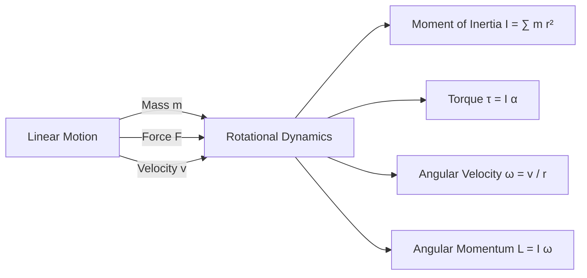

# :LiBook: Lesson 02: Mechanics

> [!ABSTRACT] Syllabus Scope (NIE Teacher's Guide)
> - Vectors & Scalars: Addition, Resolution & Dot/Cross Products
> - Kinematics: Linear Motion Equations & Projectile Motion
> - Newton's Laws of Motion, Momentum & Impulse
> - Work, Energy, Power & Efficiency
> - Uniform Circular Motion & Rotational Dynamics (Moment of Inertia, Torque, Angular Momentum)
> - Equilibrium of Rigid Bodies & Couples
> - Hydrostatics (Fluid Statics): Pressure $h
ho g$, Pascal's Law, Archimedes' Principle & Flotation

---
## 1. Kinematics & Projectile Motion

### Equations of Uniformly Accelerated Motion:
$$v = u + at, \quad s = ut + \frac{1}{2}at^2, \quad v^2 = u^2 + 2as, \quad s = \left(\frac{u+v}{2}\right)t$$

### Projectile Motion (Angle $\theta$ to horizontal):
* **Horizontal component:** $u_x = u \cos\theta$ (constant velocity).
* **Vertical component:** $u_y = u \sin\theta$ (accelerates under $g$).
* **Time of Flight:** $T = \frac{2u\sin\theta}{g}$
* **Maximum Height:** $H_{\text{max}} = \frac{u^2 \sin^2\theta}{2g}$
* **Horizontal Range:** $R = \frac{u^2 \sin 2\theta}{g}$

---
## 2. Newton's Laws, Momentum & Impulse

* **1st Law:** An object remains at rest or uniform motion unless acted upon by a net external force.
* **2nd Law:** $\mathbf{F}_{\text{net}} = \frac{d\mathbf{p}}{dt} = m\mathbf{a}$
* **3rd Law:** For every action force, there is an equal and opposite reaction force.
* **Impulse:** $\mathbf{J} = \mathbf{F} \Delta t = \Delta \mathbf{p} = m\mathbf{v} - m\mathbf{u}$
* **Conservation of Linear Momentum:** $\sum \mathbf{p}_{\text{initial}} = \sum \mathbf{p}_{\text{final}}$ (in an isolated system).

---
## 3. Circular Motion & Rotational Dynamics

> [!INFO] Deep Dive Note
> For Centripetal acceleration derivations, Moment of Inertia formulas for rigid bodies, and angular momentum conservation, read: [[Subtopics/Circular Motion & Rotational Dynamics|Circular Motion & Rotational Dynamics Guide]].

---
## 4. Hydrostatics & Archimedes' Principle

* **Liquid Pressure:** $P = h\rho g$ (Total Pressure $P_{\text{total}} = P_{\text{atm}} + h\rho g$).
* **Pascal's Law:** Pressure applied to an enclosed fluid is transmitted undiminished to all parts of the fluid ($\frac{F_1}{A_1} = \frac{F_2}{A_2}$).
* **Archimedes' Principle:** Upthrust $U = \text{Weight of fluid displaced} = V_{\text{submerged}} \cdot \rho_{\text{fluid}} \cdot g$.
* **Law of Flotation:** For a floating body, $\text{Weight of object} = \text{Upthrust}$.

$$\frac{V_{\text{submerged}}}{V_{\text{total}}} = \frac{\rho_{\text{object}}}{\rho_{\text{fluid}}}$$

---
## :LiRocket: Flashcards (Spaced Repetition)

#flashcards

State the 4 equations of linear motion for uniform acceleration. :: $v = u + at$, $s = ut + \frac{1}{2}at^2$, $v^2 = u^2 + 2as$, $s = \left(\frac{u+v}{2}\right)t$.

What are the formulas for Time of Flight $T$ and Horizontal Range $R$ of a projectile launched at speed $u$ and angle $\theta$? :: $T = \frac{2u\sin\theta}{g}$, $R = \frac{u^2\sin 2\theta}{g}$.
<!--SR:!2026-09-29,4,270-->

State Newton's Second Law of Motion in vector form. :: $\mathbf{F}_{\text{net}} = \frac{d\mathbf{p}}{dt} = m\mathbf{a}$.
<!--SR:!2026-09-26,1,230-->

What is Impulse, and how is it related to momentum? :: Impulse $\mathbf{J} = \mathbf{F}\Delta t = \Delta \mathbf{p}$ (change in momentum).
<!--SR:!2026-09-29,4,270-->

What is the relationship between linear velocity $v$ and angular velocity $\omega$? :: $v = r\omega$.
<!--SR:!2026-09-29,4,270-->

What is the rotational analogue of Newton's 2nd Law $F = ma$? :: $\tau = I\alpha$ (where $\tau$ is torque, $I$ is moment of inertia, $\alpha$ is angular acceleration).
<!--SR:!2026-09-26,1,230-->

State Archimedes' Principle. :: When a body is completely or partially immersed in a fluid, it experiences an upward upthrust equal to the weight of the fluid displaced by the body.
<!--SR:!2026-09-29,4,270-->

State the condition for a body to float in a liquid. :: The weight of the floating body must equal the upthrust (weight of the displaced liquid).
<!--SR:!2026-09-28,3,250-->