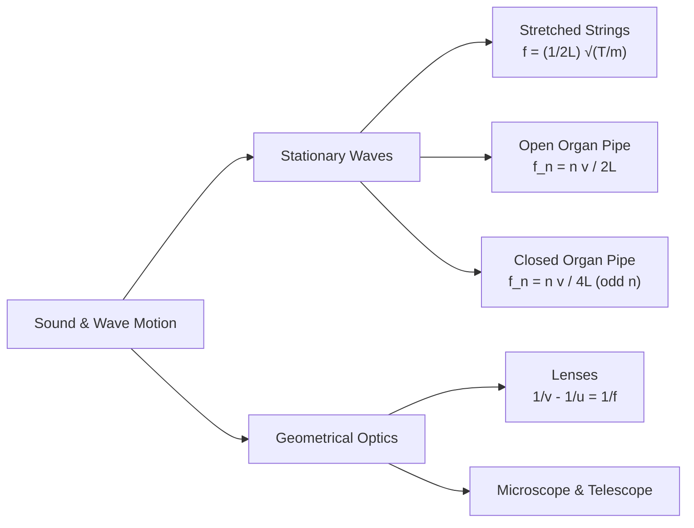

# :LiBook: Lesson 03: Oscillations & Waves

> [!ABSTRACT] Syllabus Scope (NIE Teacher's Guide)
> - Simple Harmonic Motion (SHM): Kinematics, Energy, Pendulum & Spring
> - Wave Parameters: Velocity $v=f\lambda$, Superposition, Stationary Waves
> - Sound Waves: Speed of Sound, Decibels, Organ Pipes & Resonance Tube Experiment
> - Doppler Effect
> - Geometrical Optics: Reflection, Refraction, Snell's Law, Total Internal Reflection, Prisms
> - Lenses & Optical Instruments: Lens Formula, Compound Microscope, Astronomical Telescope

---
## 1. Simple Harmonic Motion (SHM)

SHM is defined as motion where acceleration $a$ is directly proportional to displacement $x$ from equilibrium and directed towards equilibrium:
$$a = -\omega^2 x$$
* **Displacement:** $x = A \sin(\omega t + \phi)$
* **Velocity:** $v = \frac{dx}{dt} = \omega \sqrt{A^2 - x^2}$ (Max velocity $v_{\text{max}} = \omega A$ at $x = 0$)
* **Time Period:**
  * Simple Pendulum: $T = 2\pi \sqrt{\frac{l}{g}}$
  * Mass-Spring System: $T = 2\pi \sqrt{\frac{m}{k}}$
* **Energy in SHM:**
$$E_k = \frac{1}{2}m\omega^2(A^2 - x^2), \quad E_p = \frac{1}{2}m\omega^2 x^2, \quad E_{\text{total}} = \frac{1}{2}m\omega^2 A^2$$

---
## 2. Sound Waves & Stationary Waves

### Resonance Tube Experiment:
For a closed tube of length $L$ and radius $r$:

$$L_1 + e = \frac{\lambda}{4}, \quad L_2 + e = \frac{3\lambda}{4} \implies \lambda = 2(L_2 - L_1)$$

Where end correction $e = 0.6r$. Speed of sound $v = f\lambda = 2f(L_2 - L_1)$.

---
## 3. Geometrical Optics & Optical Instruments

* **Snell's Law:** $n_1 \sin\theta_1 = n_2 \sin\theta_2$
* **Total Internal Reflection:** Critical angle $\sin C = \frac{1}{n}$
* **Prism Minimum Deviation ($D_m$):** 
  $$n = \frac{\sin\left(\frac{A + D_m}{2}\right)}{\sin\left(\frac{A}{2}\right)}$$
* **Compound Microscope:**
  * Magnification (Normal adjustment): $M = m_o \times m_e = \left(\frac{v_o}{u_o}\right)\left(\frac{D}{f_e}\right)$
* **Astronomical Telescope (Normal Adjustment):**
  * Magnification: $M = \frac{f_o}{f_e}$
  * Length of Telescope Tube: $L = f_o + f_e$

---
## :LiRocket: Flashcards (Spaced Repetition)

#flashcards

State the defining equation of Simple Harmonic Motion. :: $a = -\omega^2 x$ (where $a$ is acceleration, $\omega$ is angular frequency, $x$ is displacement from equilibrium).
<!--SR:!2026-09-26,1,230-->

What is the expression for maximum velocity in SHM? :: $v_{\text{max}} = \omega A$.

What is the period of a Simple Pendulum? :: $T = 2\pi \sqrt{\frac{l}{g}}$.
<!--SR:!2026-09-26,1,230-->

State the fundamental frequency formula for a stretched string of length $L$, tension $T$, and mass per unit length $m$. :: $f = \frac{1}{2L}\sqrt{\frac{T}{m}}$.
<!--SR:!2026-09-26,1,230-->

How is the speed of sound $v$ determined using first and second resonance lengths $L_1, L_2$ in a resonance tube? :: $v = 2f(L_2 - L_1)$.
<!--SR:!2026-09-26,1,230-->

What is the critical angle condition for Total Internal Reflection? :: $\sin C = \frac{n_2}{n_1} = \frac{1}{n}$ (when light travels from denser to rarer medium).
<!--SR:!2026-09-26,1,230-->

State the magnification formula for an Astronomical Telescope in normal adjustment. :: $M = \frac{f_o}{f_e}$ (and tube length $L = f_o + f_e$).
<!--SR:!2026-09-26,1,230-->