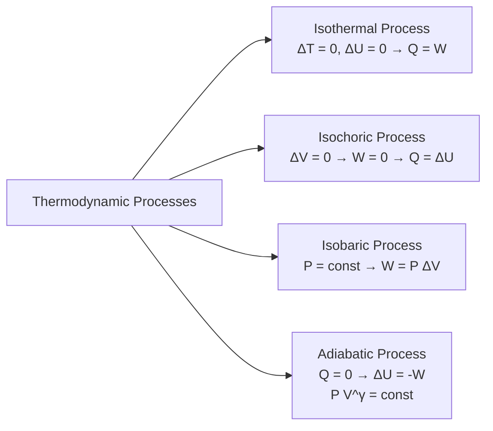

# :LiBook: Lesson 04: Thermal Physics

> [!ABSTRACT] Syllabus Scope (NIE Teacher's Guide)
> - Temperature & Thermometry (Zeroth Law, Celsius vs Kelvin)
> - Specific Heat Capacity ($Q = mc\Delta T$) & Latent Heat ($Q = mL$)
> - Ideal Gas Equation ($PV = nRT$) & Kinetic Theory ($P = rac{1}{3}
ho \overline{c^2}$)
> - First Law of Thermodynamics ($\Delta Q = \Delta U + \Delta W$) & Thermodynamic Processes
> - Heat Transfer: Conduction ($k$), Convection, Radiation (Stefan-Boltzmann & Wien's Laws)

---
## 1. Kinetic Theory & Gas Laws

Ideal gas equation:
$$PV = nRT = Nk_B T$$

Kinetic pressure equation:
$$P = \frac{1}{3}\rho \overline{c^2} = \frac{1}{3}\frac{Nm}{V}\overline{c^2}$$

Mean translational kinetic energy per molecule & RMS speed:
$$E_k = \frac{3}{2}k_B T, \quad \text{RMS Speed } c_{\text{rms}} = \sqrt{\overline{c^2}} = \sqrt{\frac{3RT}{M}}$$
---
## 2. First Law of Thermodynamics & Processes

$$\Delta Q = \Delta U + \Delta W \quad (\text{where } \Delta W = P \Delta V)$$

---
## 3. Heat Conduction & Radiation

* **Thermal Conduction:** Rate of heat flow through a uniform slab:

$$\frac{\Delta Q}{\Delta t} = k A \left(\frac{T_1 - T_2}{d}\right)$$

* **Stefan-Boltzmann Law:** Total power radiated by a black body of surface area $A$ at absolute temperature $T$:

$$P = \sigma A T^4 \quad (\sigma = 5.67 \times 10^{-8} \text{ W m}^{-2} \text{ K}^{-4})$$

* **Wien's Displacement Law:** $\lambda_{\text{max}}T = b \quad (b = 2.898 \times 10^{-3} \text{ m K})$.

---
## :LiRocket: Flashcards (Spaced Repetition)

#flashcards

State the Kinetic Theory pressure equation for an ideal gas. :: $P = \frac{1}{3}\rho \overline{c^2}$.

What is the average kinetic energy of a single ideal gas molecule at temperature $T$? :: $E_k = \frac{3}{2} k_B T$.

State the First Law of Thermodynamics. :: $\Delta Q = \Delta U + \Delta W$ (heat supplied equals change in internal energy plus work done by the system).
<!--SR:!2026-09-26,1,230-->

What is an Adiabatic process, and what is its governing equation? :: A process in which no heat enters or leaves the system ($\Delta Q = 0$); governed by $PV^\gamma = \text{constant}$.
<!--SR:!2026-09-26,1,230-->

State Fourier's Law of Thermal Conduction. :: $\frac{\Delta Q}{\Delta t} = k A \frac{T_1 - T_2}{d}$.
<!--SR:!2026-09-26,1,230-->

State Stefan-Boltzmann Law for a blackbody radiator. :: $P = \sigma A T^4$.