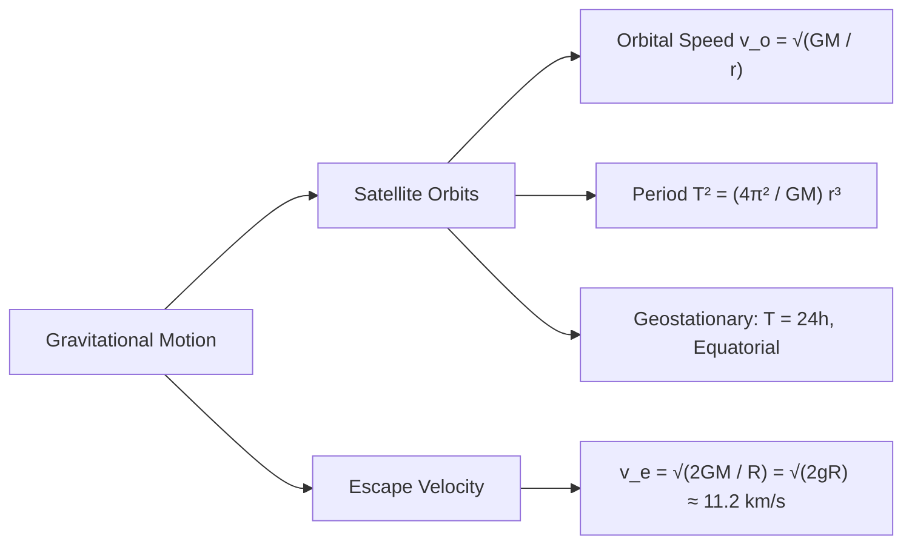

# :LiRocket: Lesson 05: Gravitational Field

> [!ABSTRACT] Syllabus Scope (NIE Teacher's Guide)
> - Newton's Law of Universal Gravitation ($F = G rac{M m}{r^2}$)
> - Gravitational Field Intensity ($g = rac{GM}{r^2}$) & Variation with Altitude/Depth
> - Gravitational Potential ($V = -rac{GM}{r}$) & Potential Energy ($U = -rac{GMm}{r}$)
> - Satellite Orbits, Kepler's 3rd Law ($T^2 \propto r^3$), Geostationary Satellites
> - Escape Velocity ($v_e = \sqrt{2gR}$)

---
## 1. Gravitational Field & Potential Formulas

* **Newton's Gravitational Law:** $F = G \frac{M m}{r^2} \quad (G = 6.67 \times 10^{-11} \text{ N m}^2 \text{ kg}^{-2})$
* **Field Intensity ($g$):** Force per unit mass $g = \frac{GM}{r^2}$.
  * Altitude $h$: $g_h = \frac{GM}{(R+h)^2} \approx g \left(1 - \frac{2h}{R}\right)$ for $h \ll R$.
  * Depth $d$: $g_d = g \left(1 - \frac{d}{R}\right)$.
* **Gravitational Potential ($V$):** Work done per unit mass in bringing a test mass from infinity:

$$V = -\frac{GM}{r}, \quad U = mV = -\frac{GMm}{r}$$

---
## 2. Satellite Orbits & Escape Velocity

---
## :LiRocket: Flashcards (Spaced Repetition)

#flashcards

State Newton's Law of Universal Gravitation. :: $F = G \frac{m_1 m_2}{r^2}$.

What is the gravitational potential $V$ at distance $r$ from mass $M$? :: $V = -\frac{GM}{r}$.

State Kepler's Third Law of Planetary Motion. :: The square of the orbital period $T$ of a satellite is directly proportional to the cube of the orbital radius $r$ ($T^2 \propto r^3$).

What is the orbital speed $v_o$ of a satellite orbiting at distance $r$ from Earth's center? :: $v_o = \sqrt{\frac{GM}{r}}$.

What is Escape Velocity, and what is its value at Earth's surface? :: The minimum initial velocity required for an object to escape a body's gravitational field permanently; $v_e = \sqrt{2gR} \approx 11.2\text{ km/s}$.