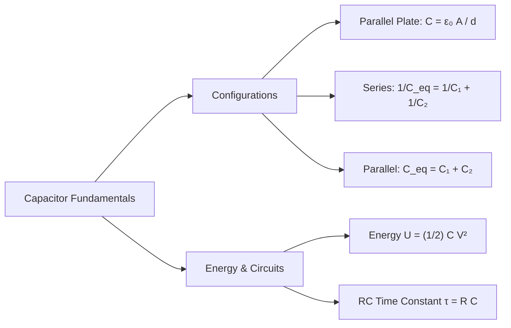

# :LiBook: Lesson 06: Electrostatic Field

> [!ABSTRACT] Syllabus Scope (NIE Teacher's Guide)
> 
> * Coulomb's Law ($F = \frac{1}{4\pi\varepsilon_0 \varepsilon_r} \frac{q_1 q_2}{r^2}$)
> * Electric Field Intensity ($E$) & Equipotential Surfaces
> * Gauss's Law & Electric Flux ($\Phi = \oint E \, dA = \frac{Q}{\varepsilon_0}$)
> * Electric Potential ($V$) & Potential Energy ($U$)
> * Capacitors: Parallel Plate ($C = \frac{\varepsilon_0 A}{d}$), Combinations, Energy ($U = \frac{1}{2} C V^2$), RC Circuits

---
## 1. Electrostatic Force, Field & Gauss's Law

* **Coulomb's Law:** $F = \frac{1}{4\pi\varepsilon_0 \varepsilon_r} \frac{q_1 q_2}{r^2} \quad (\varepsilon_0 = 8.854 \times 10^{-12} \text{ F/m})$
* **Electric Field Intensity ($E$):** $E = \frac{F}{q} = \frac{1}{4\pi\varepsilon_0} \frac{Q}{r^2}$
* **Gauss's Law:** Net electric flux through any closed surface equals $\frac{Q_{\text{enclosed}}}{\varepsilon_0}$:

$$\Phi_E = \oint \mathbf{E} \cdot d\mathbf{A} = \frac{Q_{\text{enclosed}}}{\varepsilon_0}$$

---
## 2. Capacitors & RC Circuits

---
## :LiRocket: Flashcards (Spaced Repetition)

#flashcards

State Coulomb's Law of electrostatics. :: $F = \frac{1}{4\pi\varepsilon_0 \varepsilon_r} \frac{q_1 q_2}{r^2}$.

State Gauss's Law for electrostatics. :: The net electric flux through any closed surface equals the total enclosed charge divided by $\varepsilon_0$ ($\Phi = \oint \mathbf{E} \cdot d\mathbf{A} = \frac{Q}{\varepsilon_0}$).

What is the relation between electric field $E$ and electric potential $V$? :: $E = -\frac{dV}{dr}$.
<!--SR:!2026-09-26,1,230-->

State the capacitance formula for a parallel-plate capacitor with dielectric constant $\varepsilon_r$. :: $C = \frac{\varepsilon_0 \varepsilon_r A}{d}$.
<!--SR:!2026-09-26,1,230-->

State the 3 equivalent expressions for energy stored in a capacitor. :: $U = \frac{1}{2} Q V = \frac{1}{2} C V^2 = \frac{Q^2}{2C}$.