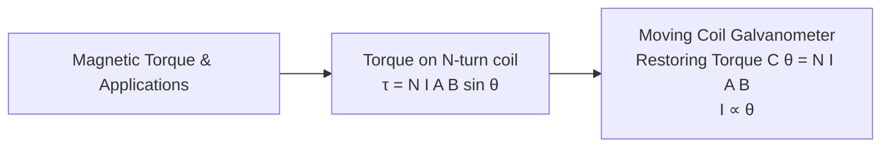

# :LiBook: Lesson 07: Magnetic Field

> [!ABSTRACT] Syllabus Scope (NIE Teacher's Guide)
> 
> * Magnetic Field ($B$) & Lorentz Force ($F = q v B \sin\theta$)
> * Force on Current-Carrying Conductor ($F = I L B \sin\theta$)
> * Biot-Savart Law & Field due to Straight Wire ($B = \frac{\mu_0 I}{2\pi r}$), Loop ($B = \frac{\mu_0 I}{2R}$), Solenoid ($B = \mu_0 n I$)
> * Force Between Parallel Current Wires ($\frac{F}{L} = \frac{\mu_0 I_1 I_2}{2\pi d}$) & Definition of Ampere
> * Torque on Current Coil ($\tau = N I A B \sin\theta$) & Moving Coil Galvanometer

---
## 1. Magnetic Forces & Biot-Savart Law

* **Lorentz Force:** $\mathbf{F} = q(\mathbf{E} + \mathbf{v} \times \mathbf{B})$
* **Force on Wire:** $F = I L B \sin\theta$ (Direction by Fleming's Left-Hand Rule)
* **Biot-Savart Law:** $dB = \frac{\mu_0}{4\pi} \frac{I \, dl \sin\theta}{r^2} \quad (\mu_0 = 4\pi \times 10^{-7} \text{ T m A}^{-1})$
* **Ampère's Circuital Law:** $\oint \mathbf{B} \cdot d\mathbf{l} = \mu_0 I_{\text{enclosed}}$

---
## 2. Torque on Coil & Moving Coil Galvanometer

---
## :LiRocket: Flashcards (Spaced Repetition)

#flashcards

What is the magnetic force on a charge $q$ moving with velocity $v$ at angle $\theta$ to magnetic field $B$? :: $F = q v B \sin\theta$.

What is the force per unit length between two parallel long straight conductors carrying currents $I_1, I_2$ separated by distance $d$? :: $\frac{F}{L} = \frac{\mu_0 I_1 I_2}{2\pi d}$.

State the magnetic field $B$ inside a long solenoid of $n$ turns per unit length carrying current $I$. :: $B = \mu_0 n I$.

How is the SI unit of current (Ampere) defined using magnetic force? :: 1 Ampere is the constant current which, if maintained in two straight parallel conductors of infinite length placed 1 meter apart in vacuum, produces a force of $2 \times 10^{-7}\text{ N/m}$ between them.

What is the deflecting torque $\tau$ on an $N$-turn coil of area $A$ carrying current $I$ in a radial magnetic field $B$? :: $\tau = N I A B$.