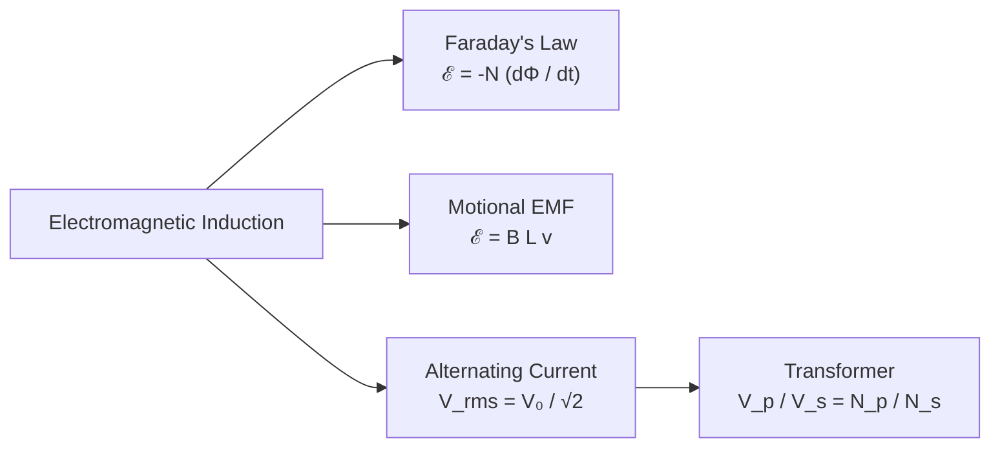

# :LiBook: Lesson 08: Current Electricity

> [!abstract] Syllabus Scope (NIE Teacher's Guide)
> - Drift Velocity ($I = n A e v_d$), Resistance & Temperature Coefficient ($\alpha$)
> - Internal Resistance ($V = E - Ir$) & Series/Parallel Cells
> - Kirchhoff's Laws (KCL & KVL), Wheatstone Bridge & Meter Bridge
> - Potentiometer: EMF comparison & Internal Resistance ($r = R \frac{l_1 - l_2}{l_2}$)
> - Electromagnetic Induction: Faraday's Law ($\mathcal{E} = -N \frac{d\Phi}{dt}$), Lenz's Law, Motional EMF ($\mathcal{E} = BLv$)
> - Alternating Current ($V_{\text{rms}} = \frac{V_0}{\sqrt{2}}$) & Transformers

---
## 1. Kirchhoff's Laws & Potentiometer

> [!note] Deep Dive Note
> For circuit solving methods, Wheatstone bridge balance conditions, and Potentiometer internal resistance experiment setup, read: [[Potentiometer & Kirchhoff's Laws Guide]].

* **KCL (Kirchhoff's Current Law):** $\sum I = 0$ (Conservation of Charge)
* **KVL (Kirchhoff's Voltage Law):** $\sum V = \sum IR$ (Conservation of Energy)
* **Potentiometer:** Potential gradient $k = \frac{V}{L}$.
* **Internal resistance:** $r = R \left(\frac{l_1 - l_2}{l_2}\right)$

---
## 1. Kirchhoff's Laws & Potentiometer

> [!INFO] Deep Dive Note
> For circuit solving methods, Wheatstone bridge balance conditions, and Potentiometer internal resistance experiment setup, read: [[Subtopics/Potentiometer & Kirchhoffs Laws|Potentiometer & Kirchhoff's Laws Guide]].

* **KCL (Kirchhoff's Current Law):** $\sum I = 0$ (Conservation of Charge)
* **KVL (Kirchhoff's Voltage Law):** $\sum V = \sum IR$ (Conservation of Energy)
* **Potentiometer:** Potential gradient $k = \frac{V}{L}$.
* **Internal resistance:** $r = R \left(\frac{l_1 - l_2}{l_2}\right)$

---
## 2. Electromagnetic Induction & AC Circuits

---
## :LiRocket: Flashcards (Spaced Repetition)

#flashcards

State Kirchhoff's First Law (KCL) and Second Law (KVL) and their conservation principles. :: KCL: $\sum I = 0$ at a junction (Conservation of Charge); KVL: $\sum \mathcal{E} = \sum IR$ around a closed loop (Conservation of Energy).

Why is a Potentiometer preferred over a Voltmeter to measure EMF? :: A Potentiometer draws zero current from the source at the balance point, measuring true EMF without internal resistance voltage drop.

What is the formula for internal resistance $r$ using a Potentiometer? :: $r = R \left(\frac{l_1 - l_2}{l_2}\right)$ (where $l_1$ is open-circuit balance length, $l_2$ is closed-circuit balance length across shunt resistance $R$).

State Faraday's Law and Lenz's Law of Electromagnetic Induction. :: Faraday's Law: Induced EMF is proportional to the rate of change of magnetic flux linkage ($\mathcal{E} = -N \frac{d\Phi}{dt}$); Lenz's Law: Induced current flows in a direction opposing the flux change causing it.

What is the relationship between peak voltage $V_0$ and RMS voltage $V_{\text{rms}}$ in a sinusoidal AC circuit? :: $V_{\text{rms}} = \frac{V_0}{\sqrt{2}} \approx 0.707 V_0$.