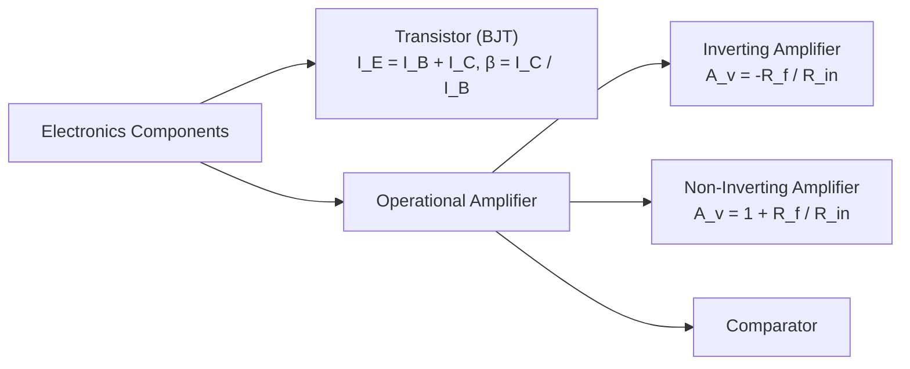

# :LiBook: Lesson 09: Electronics

> [!abstract] Syllabus Scope (NIE Teacher's Guide)
> - Semiconductors (P-type, N-type), PN Junction & Diodes
> - Rectification (Half-wave & Full-wave Bridge) & Zener Diode Regulator
> - Bipolar Junction Transistor (BJT): $I_E = I_B + I_C$, Current Gain ($\beta = \frac{I_C}{I_B}$), Switch & CE Amplifier
> - Operational Amplifier (Op-Amp): Ideal properties, Inverting ($A_v = -\frac{R_f}{R_{\text{in}}}$), Non-Inverting ($A_v = 1 + \frac{R_f}{R_{\text{in}}}$), Comparator
> - Digital Logic Gates & Combination Circuits

---
## 1. Transistors & Operational Amplifiers

> [!INFO] Deep Dive Note
> For CE transistor operating regions, Op-Amp gain derivations, and virtual ground concept, read: [[Subtopics/Transistors & Operational Amplifiers|Transistors & Operational Amplifiers Guide]].

---
## :LiRocket: Flashcards (Spaced Repetition)

#flashcards

What is the relationship between Emitter ($I_E$), Base ($I_B$), and Collector ($I_C$) currents in a transistor? :: $I_E = I_B + I_C$.
<!--SR:!2026-09-26,1,230-->

What is the DC current gain $\beta$ of a common-emitter transistor? :: $\beta = \frac{I_C}{I_B}$.
<!--SR:!2026-09-26,1,230-->

List 4 ideal characteristics of an Operational Amplifier (Op-Amp). :: 1. Infinite input impedance ($R_{\text{in}} = \infty$), 2. Zero output impedance ($R_{\text{out}} = 0$), 3. Infinite open-loop voltage gain ($A_{OL} = \infty$), 4. Infinite bandwidth.

What is the voltage gain $A_v$ of an Inverting Op-Amp circuit? :: $A_v = -\frac{R_f}{R_{\text{in}}}$.
<!--SR:!2026-09-26,1,230-->

What is the voltage gain $A_v$ of a Non-Inverting Op-Amp circuit? :: $A_v = 1 + \frac{R_f}{R_{\text{in}}}$.