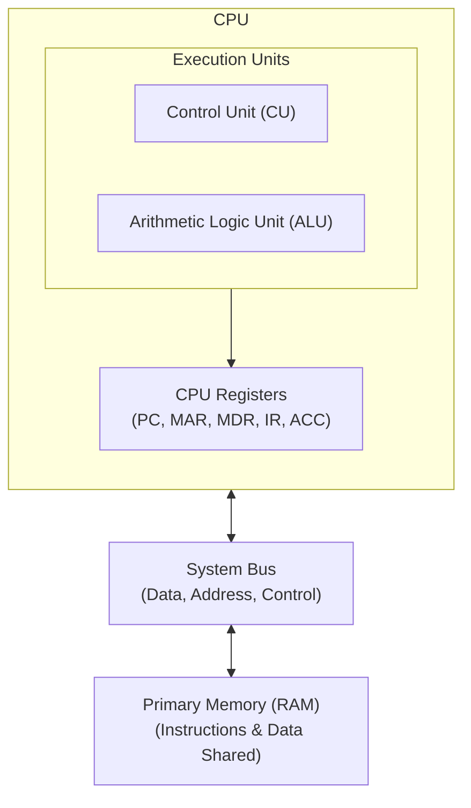
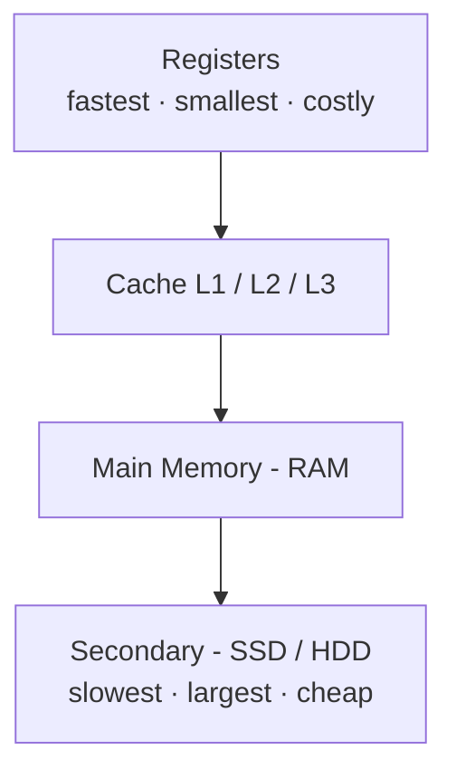
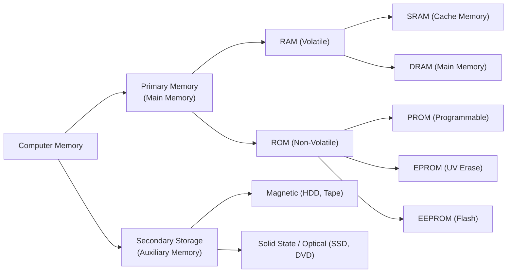

#  Lesson 02: Evolution of Computing Devices & Architecture

> [!ABSTRACT] Syllabus Scope (NIE Teacher's Guide)
> - Historical milestones & Computer Generations (1st to 5th)
> - Classification (technology / purpose / size)
> - Functional components of a computer system & System Buses
> - Von Neumann Architecture vs Harvard Architecture
> - Memory Hierarchy (Registers, Cache, Primary, Secondary)

---
## 1. Evolution of Computing Devices

- **Abacus**: Earliest manual calculating device using beads on rods.
- **Pascaline (Blaise Pascal)**: First mechanical calculator using gears and wheels (addition/subtraction).
- **Analytical Engine (Charles Babbage)**: First general-purpose mechanical computer concept featuring input, mill (CPU), store (memory), and output. ==Charles Babbage== is the *Father of Computing*. ==**Ada Lovelace**== was the *First Computer Programmer*.
- **ENIAC (Electronic Numerical Integrator and Computer)**: First general-purpose fully electronic digital computer (used vacuum tubes).
- **EDVAC (Electronic Discrete Variable Automatic Computer)**: First computer to implement the **Stored Program Concept**.
<!--SR:!2026-10-09,14,290!2026-09-29,4,270-->

---
## 2. Generations of Computers

| Generation | Major Technology | Key Characteristics / Examples |
| :---: | :--- | :--- |
| **1st Gen** (1940-1956) | **Vacuum Tubes** | Huge size, high heat, unreliable, machine language (ENIAC, EDVAC, UNIVAC). |
| **2nd Gen** (1956-1963) | **Transistors** | Smaller, faster, more energy-efficient, assembly language, FORTRAN/COBOL (IBM 7090). |
| **3rd Gen** (1964-1971) | **Integrated Circuits (ICs)** | Multiple transistors on a silicon chip, OS introduced, keyboards & monitors (IBM 360). |
| **4th Gen** (1971-Present) | **Microprocessors (VLSI / LSI)** | Entire CPU on a single chip, Personal Computers (PCs), Internet explosion (Intel 4004, PCs). |
| **5th Gen** (Present & Beyond) | **Ultra Large Scale Integration (ULSI) & AI** | Artificial intelligence, parallel processing, quantum computing, voice recognition. |

---
## 3. Classification of Computers

### By Technology
- **Analog**: works on continuous physical quantities (voltage, temperature, pressure). E.g. old analog speedometer, thermometer, tide predictor.
- **Digital**: works on discrete `0/1`. All modern computers (ENIAC onwards).
- **Hybrid**: both — digital control + analog sensing. E.g. hospital ICU monitors, petrol pump, weather station.

### By Purpose
- **Special-purpose**: one dedicated task (ATM, washing-machine controller, router). Fast for that job, inflexible.
- **General-purpose**: many tasks via stored programs (PC, laptop, phone).

### By Size / Capacity
- **Supercomputer**: fastest, parallel thousands of CPUs (weather, nuclear simulation, AI training).
- **Mainframe**: large, multi-user, high I/O (banks, airlines).
- **Minicomputer**: mid-range server for a department (now called midrange server).
- **Microcomputer**: single-user chip-based — desktop, laptop, tablet, smartphone, phablet.

---
## 4. Computer Hardware Components & System Buses

A computer system consists of:
1. **Central Processing Unit (CPU)**:
   - **Control Unit (CU)**: Directs operations, fetches and decodes instructions.
   - **Arithmetic Logic Unit (ALU)**: Performs arithmetic operations (`+`, `-`, `*`) and logical evaluations (`AND`, `OR`, `NOT`, comparisons).
   - **Registers**: Ultra-fast internal temporary memory storage inside CPU.
2. **Memory Unit**: Primary (RAM/ROM) & Cache.
3. **Input / Output Units**: Peripherals to interact with users.

### System Buses:
Buses are sets of parallel wires that transmit electrical signals between components.
- **Data Bus (Bidirectional)**: Transfers data between CPU, memory, and I/O devices.
- **Address Bus (Unidirectional)**: Carries memory address generated by CPU. An $N$-bit address bus can address $2^N$ unique memory locations.
- **Control Bus**: Carries control and timing signals (Read/Write signals, interrupts, clock signals).

---
## 5. Von Neumann Architecture

The **Von Neumann Architecture** is based on the **Stored Program Concept**, where both program instructions and data share the **same physical memory and bus system**.

> [!INFO] Deep Dive Note
> For register details (PC, MAR, MDR, IR, ACC), fetch-execute steps, and Von Neumann Bottleneck, read: [[Subtopics/Von Neumann Architecture|Von Neumann Architecture]].

---
## 6. Memory Hierarchy

Computers arrange memory in a hierarchy balancing **speed, capacity, and cost per bit**:

### Memory Classification:

> [!INFO] Access methods (sequential / direct / random)
> Tape is **sequential**, HDD/CD are **direct**, RAM is **random** — they are not the same. Full definitions and the exam trap: [[Subtopics/Sequential Direct & Random Access|Sequential, Direct & Random Access]].

- **SRAM (Static RAM)**: Made of flip-flops; faster, no refresh required, used for **Cache memory** (L1, L2, L3).
- **DRAM (Dynamic RAM)**: Made of capacitors & transistors; requires periodic refreshing, used for **Main memory (RAM)**.
- **ROM Types**:
  - **PROM**: Programmable ROM (written once).
  - **EPROM**: Erasable PROM (erased using Ultraviolet light).
  - **EEPROM**: Electrically Erasable PROM (erased electrically; used in Flash memory & BIOS).

---

## :LiRocket: Flashcards (Spaced Repetition)

#flashcards

Who is known as the Father of Computing, and what machine did he design? :: Charles Babbage; the Analytical Engine.
<!--SR:!2026-09-29,4,270-->

Who was the first computer programmer? :: Ada Lovelace.
<!--SR:!2026-10-09,14,290-->

What key technological innovation characterized Second Generation computers? :: Transistors.
<!--SR:!2026-09-29,4,270-->

Classify computers by technology with one example each. :: Analog (continuous, e.g. thermometer), Digital (discrete 0/1, e.g. PC), Hybrid (both, e.g. ICU monitor).

What is special vs general purpose? :: Special = one dedicated task (ATM); General = many tasks via programs (PC).

Order super/mainframe/mini/micro by size. :: Super (fastest parallel) > Mainframe (multi-user) > Mini (department server) > Micro (single-user PC/phone).

What technology enabled Fourth Generation computers? :: Very Large Scale Integration (VLSI) microprocessors.
<!--SR:!2026-10-09,14,290-->

What is the Stored Program Concept? :: The concept where both data and program instructions are stored together in the same memory space of a computer system.
<!--SR:!2026-09-29,4,270-->

Name the 3 main components of the CPU. :: 1. Control Unit (CU), 2. Arithmetic Logic Unit (ALU), 3. Registers.

What is the difference between a Data Bus and an Address Bus? :: Data Bus is bidirectional and carries actual data; Address Bus is unidirectional and carries memory location addresses from the CPU.

If an address bus has 16 lines (16-bit), how many unique memory locations can it address? :: $2^{16} = 65,536$ memory locations (64 KB).
<!--SR:!2026-10-10,15,290-->

What is the difference between SRAM and DRAM? :: SRAM uses flip-flops, is faster, does not require refreshing, and is used for cache; DRAM uses capacitors, requires periodic refreshing, and is used for main memory.

How is data erased in an EPROM compared to an EEPROM? :: EPROM is erased using Ultraviolet (UV) light; EEPROM is erased electrically.
<!--SR:!2026-10-09,14,290-->

Which is faster, DRAM or SRAM? :: SRAM.

Who invented transistor at Bell Labs in 1947?::William Shockley, John Barden and Walter Brattain.
<!--SR:!2026-09-26,1,230-->

Which computer bus carries information from the processor to the I/O devices?::Data bus.
<!--SR:!2026-09-29,4,270-->

Who is the father of modern computer science?::Alan Turing.
<!--SR:!2026-10-11,16,290-->

Name first general purpose computer, commercially sold computer and store program computer.:: ENIAC, UNIVAC, and EDSAC

Explain the differences of Direct access, Sequential access, and Random access.::**Sequential access** reads data linearly from the beginning (like a cassette tape), **direct access** jumps to a specific block's physical vicinity and then searches locally (like a hard drive), while **random access** reaches any exact location instantly with uniform, constant time (like RAM).