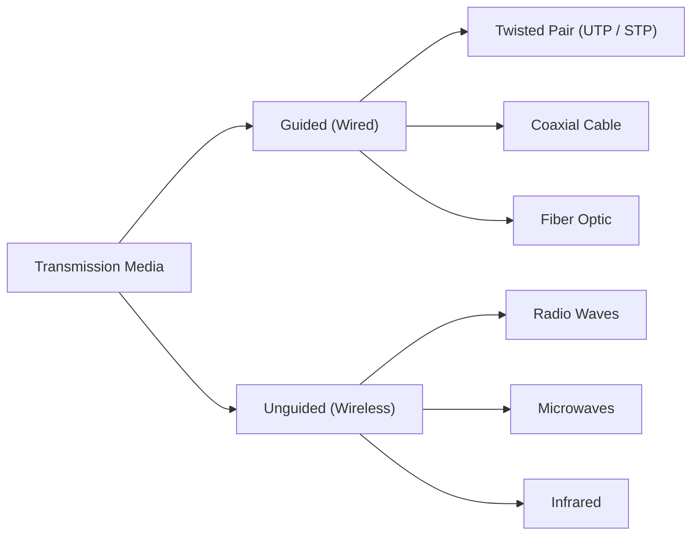

# :LiGlobe: Lesson 06: Data Communication & Computer Networking

> [!ABSTRACT] Scope
> A comprehensive guide to understanding how computers talk to each other. We will cover the physical properties of signals, the media they travel on, how we ensure they arrive intact, the devices that direct them, and the logical models (OSI & TCP/IP) that govern the entire process.

---

## 1. Fundamentals of Data Communication

Data communication is the exchange of data between two or more devices via some form of transmission medium. A complete communication system has five components:
1. **Message**: The data/information to be communicated.
2. **Sender**: The device sending the data.
3. **Receiver**: The device receiving the data.
4. **Transmission Medium**: The physical path (cable or wireless) the data travels on.
5. **Protocol**: A set of rules governing the communication (e.g., how to handle errors).

### 1.1 Data Flow Modes
- **Simplex**: One-way communication only (e.g., Radio broadcast, Keyboard to PC).
- **Half-Duplex**: Two-way, but **not simultaneously** (e.g., Walkie-Talkies).
- **Full-Duplex**: Two-way, **simultaneous** communication (e.g., Telephone calls).

### 1.2 Waves vs. Signals
- **Wave**: A physical phenomenon that carries energy (e.g., light, sound).
- **Signal**: An electronic voltage or current that carries **data/information**. A wave becomes a signal when it is used to carry information.

#### Properties of Waves/Signals:
- **Amplitude**: The height of the wave. Determines the strength/intensity.
- **Frequency ($f$)**: Number of cycles per second. Measured in Hertz (Hz).
- **Period ($T$)**: Time taken for one cycle. ($T = 1/f$).
- **Wavelength ($\lambda$)**: Distance between two consecutive identical points on the wave.
- **Phase**: The position of the wave at a specific point in time (often measured in degrees from 0 to 360).

---

## 2. Signal Transmission and Impairments

When a signal travels through a medium, it loses energy or gets distorted.

### 2.1 Transmission Impairments
1. **Attenuation**: The gradual loss of signal strength over a distance. (Solution: Use amplifiers for analog, or repeaters for digital signals).
2. **Distortion**: The signal changes its shape or form. Happens because different frequency components travel at different speeds.
3. **Noise**: Unwanted electrical/electromagnetic energy added to the signal (e.g., Thermal noise, Crosstalk, Impulse noise).

### 2.2 Latency, Bandwidth, and Throughput
- **Bandwidth**: The theoretical maximum capacity of a channel (how much data it *could* handle).
- **Throughput**: The actual, realized data rate (how much data successfully arrives). Always $\le$ Bandwidth.
- **Latency (Delay)**: The total time it takes for a message to travel from sender to receiver. It consists of:
  1. **Propagation Delay**: Time taken to travel the physical distance.
  2. **Transmission Delay**: Time taken to push all bits into the wire (Depends on file size and bandwidth).
  3. **Processing Delay**: Time taken by routers/switches to inspect the packet.
  4. **Queuing Delay**: Time the packet spends waiting in a router's buffer due to traffic.

---

## 3. Digital Encoding & Modulation

Computers understand binary (0s and 1s), but physical media carry waves.

### 3.1 Digital Encoding (Digital Data to Digital Signal)
Converting bits into electrical pulses.
- **NRZ (Non-Return to Zero)**: High voltage for 1, low voltage for 0. Fails to maintain synchronization if there's a long sequence of 0s or 1s.
- **Manchester Encoding**: Uses **transitions** to represent data. E.g., High-to-Low means 0, Low-to-High means 1. Because there is a transition in the middle of *every* bit, the receiver can easily synchronize its clock.

### 3.2 Modulation (Digital Data to Analog Signal)
Used when we need to send digital data over analog mediums (like telephone lines or radio waves). We use a high-frequency **Carrier Wave** and modify one of its properties:
- **ASK (Amplitude Shift Keying)**: Change the amplitude to represent 0 and 1.
- **FSK (Frequency Shift Keying)**: Change the frequency.
- **PSK (Phase Shift Keying)**: Change the phase (shift the wave).

### 3.3 Multiplexing
Sending multiple signals over a **single** communication link simultaneously.
- **TDM (Time Division Multiplexing)**: Devices take turns. Each gets a "time slot".
- **FDM (Frequency Division Multiplexing)**: The total bandwidth is divided into separate frequency bands (like radio stations).
- **WDM (Wavelength Division Multiplexing)**: Used in Fiber Optics. Different signals use different colors of light.

---

## 4. Transmission Media

1. **Twisted Pair**: Wires are twisted to cancel out Electromagnetic Interference (EMI). Can be Unshielded (UTP) or Shielded (STP). Uses RJ-45 connectors.
2. **Coaxial Cable**: Has a central copper core, dielectric insulator, metallic shield, and outer jacket. Highly resistant to noise.
3. **Fiber Optic**: Uses light (Total Internal Reflection) to transmit data. Immune to EMI, very high bandwidth, but expensive and fragile.

---

## 5. Network Topologies

How devices are arranged and connected.
- **Point-to-Point**: Direct link between two devices.
- **Bus**: All devices connect to a single central cable (backbone). Easy to install, but if the backbone fails, the network fails. Uses CSMA/CD to handle collisions.
- **Star**: All devices connect to a central device (Hub/Switch). If a cable breaks, only that PC is affected. If the Switch fails, the network fails.
- **Ring**: Devices connect in a closed loop. Data travels in one direction. A single break brings down the network.
- **Mesh**: Every device connects to every other device. High reliability and redundancy, but very expensive and complex to wire.
- **Tree**: A combination of Bus and Star.

---

## 6. Network Devices & Media Access Control

When multiple devices share a medium, they need rules to avoid talking over each other (**Collisions**).
- **CSMA/CD (Carrier Sense Multiple Access with Collision Detection)**: Used in wired Ethernet. Devices "listen" to the wire. If clear, they transmit. If two transmit at once, a collision occurs, they detect it, stop, wait a random time, and retry.
- **CSMA/CA (Collision Avoidance)**: Used in Wi-Fi.

### Devices
- **Repeater**: (Layer 1) Amplifies a weak signal to extend its range.
- **Hub**: (Layer 1) Connects multiple devices. It is a "dumb" device—when it receives data on one port, it broadcasts it to **all** other ports. Creates high traffic and collisions.
- **Switch**: (Layer 2) Intelligent. It learns the **MAC Addresses** of connected devices. When data arrives, it forwards it *only* to the specific destination port.
- **Router**: (Layer 3) Connects different networks together (e.g., your LAN to the Internet). Routes packets based on **IP Addresses**.
- **Modem**: Modulates digital data into analog signals (for phone lines) and demodulates them back.
- **Firewall**: Filters incoming and outgoing traffic based on security rules to protect the network.

---

## 7. The OSI & TCP/IP Reference Models

To make networking standard, the ISO created the 7-Layer OSI model. The Internet actually uses the simpler 4-Layer TCP/IP model.

| OSI Layer (1 to 7) | TCP/IP Layer | Function | Protocol/Device | Data Unit |
| :--- | :--- | :--- | :--- | :--- |
| **7. Application** | Application | Interfaces with user apps (browsers, email) | HTTP, FTP, DNS | Data |
| **6. Presentation** | Application | Data formatting, encryption, compression | SSL/TLS, JPEG | Data |
| **5. Session** | Application | Establishes and maintains connections | RPC, NetBIOS | Data |
| **4. Transport** | Transport | End-to-end reliable delivery, Error recovery | TCP, UDP, Port #'s | Segment |
| **3. Network** | Internet | Routing across different networks, logical addressing | IP, Routers | Packet |
| **2. Data Link** | Network Access | Physical addressing, node-to-node delivery | MAC, Ethernet, Switch | Frame |
| **1. Physical** | Network Access | Transmitting raw bits over physical media | Cables, Hubs | Bits |

### Encapsulation & Decapsulation
- As data moves **down** the sender's OSI layers, each layer adds its own header (like putting a letter in an envelope, and then putting that envelope in a box). This is **Encapsulation**.
- As data moves **up** the receiver's layers, headers are stripped off. This is **Decapsulation**.

> [!INFO] IPv4 & Subnetting
> For a detailed breakdown of IP Classes, CIDR, and how to calculate subnets, see the [[Subtopics/IP Addressing & Subnetting|IP Addressing & Subnetting Guide]].

---

## :LiRocket: Flashcards (Spaced Repetition)

#flashcards

What is the difference between Bandwidth and Throughput? :: Bandwidth is the theoretical maximum capacity of a channel, while throughput is the actual, realized data transfer rate (which is always less than or equal to bandwidth due to overhead and latency).

What is the purpose of Manchester Encoding? :: It ensures there is a voltage transition in the middle of every bit, allowing the receiver to easily synchronize its clock with the sender and prevent timing errors.
<!--SR:!2026-09-26,1,230-->

Why is Fiber Optic cable immune to Electromagnetic Interference (EMI)? :: Because it transmits data using light pulses through glass/plastic instead of electrical signals through copper.
<!--SR:!2026-09-29,4,270-->

In a Star Topology, what happens if the central switch fails? :: The entire network goes down, as all devices rely on the central switch to communicate.

What is the difference between a Hub and a Switch? :: A hub broadcasts incoming data to all connected ports (causing collisions), whereas a switch inspects the MAC address and forwards the data only to the specific destination port.
<!--SR:!2026-09-26,1,230-->

What is the main function of the Network Layer (Layer 3) in the OSI model? :: Routing packets across different networks using logical IP addresses.

What is Encapsulation in networking? :: The process of adding protocol headers (and sometimes trailers) to data as it moves down the OSI layers from the Application layer to the Physical layer.

What does CSMA/CD stand for and where is it used? :: Carrier Sense Multiple Access with Collision Detection. It is used in wired Ethernet networks to manage medium access and handle collisions.

What is the difference between TCP and UDP? :: TCP is reliable, connection-oriented, and guarantees ordered delivery. UDP is fast, connectionless, and does not guarantee delivery (used for live streaming).
<!--SR:!2026-09-28,3,250-->