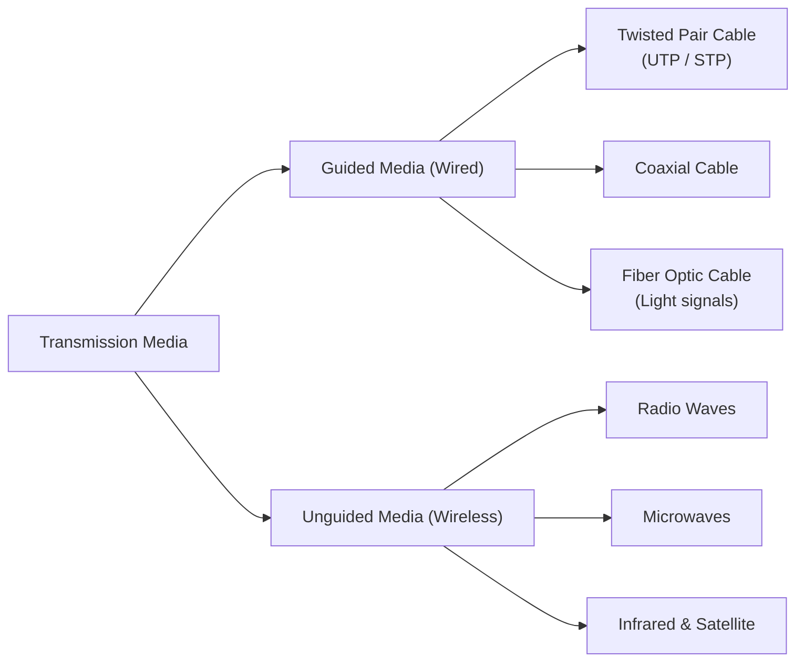

# Lesson 06: Data Communication & Computer Networking

> [!ABSTRACT] Syllabus Scope (NIE Teacher's Guide)
> - Signals, Bandwidth, Bit Rate & Transmission Media (Guided vs Unguided)
> - OSI 7-Layer Model & TCP/IP 4-Layer Architecture
> - Network Topologies & Devices (Hub, Switch, Router)
> - IP Addressing (IPv4 Classful & Classless CIDR Subnetting, IPv6)
> - MAC Protocol (CSMA/CD, CSMA/CA) & Network Security (Firewall, Encryption)

---
## 1. Data Communication Fundamentals

- **Signal Types**:
  - **Analog**: Continuous waveform (varies in frequency, amplitude, phase).
  - **Digital**: Discrete electrical pulses representing 0s and 1s.
- **Bit Rate vs. Baud Rate**:
  - **Bit Rate**: Number of bits transmitted per second (bps).
  - **Baud Rate**: Number of signal units/changes transmitted per second.
- **Transmission Modes**:
  - **Simplex**: Unidirectional (e.g., Radio broadcast).
  - **Half-Duplex**: Bidirectional, but one direction at a time (e.g., Walkie-talkie).
  - **Full-Duplex**: Simultaneous bidirectional (e.g., Telephone call).

---
## 2. Transmission Media

- **Fiber Optic**: Transmits data as light pulses through glass/plastic core; immune to Electromagnetic Interference (EMI), highest bandwidth.

---
## 3. Reference Models: OSI 7-Layer vs TCP/IP

| Layer # | OSI 7-Layer Model | TCP/IP Model | Protocol / Device Examples |
| :---: | :--- | :--- | :--- |
| **7** | Application | Application | HTTP, HTTPS, FTP, SMTP, DNS |
| **6** | Presentation | Application | SSL/TLS, ASCII, Data Compression |
| **5** | Session | Application | NetBIOS, RPC, Session Management |
| **4** | Transport | Transport | TCP (connection-oriented), UDP (connectionless) |
| **3** | Network | Internet | IP (IPv4/IPv6), ICMP, Router |
| **2** | Data Link | Network Interface | Ethernet, Wi-Fi, MAC Address, Switch |
| **1** | Physical | Network Interface | Cables, Hub, Repeater, Signals |

---
## 4. IP Addressing & Subnetting

> [!INFO] Deep Dive Note
> For complete step-by-step subnetting calculations, CIDR notation (`/24`, `/26`), Network ID & Broadcast ID determination, read: [[Subtopics/IP Addressing & Subnetting|IPv4 Addressing & Subnetting Guide]].

- **IPv4 Format**: 32-bit dotted-decimal notation (`192.168.1.1`).
- **Classful Addressing**:
  - Class A: `1.0.0.0` - `127.255.255.255` (Default Mask: `255.0.0.0` / `/8`)
  - Class B: `128.0.0.0` - `191.255.255.255` (Default Mask: `255.255.0.0` / `/16`)
  - Class C: `192.0.0.0` - `223.255.255.255` (Default Mask: `255.255.255.0` / `/24`)
- **Private IP Ranges**: `10.0.0.0/8`, `172.16.0.0/12`, `192.168.0.0/16`.
- **IPv6**: 128-bit hexadecimal address system to solve IPv4 exhaustion.

---
## 5. Network Devices & MAC Protocol

- **Hub**: Physical layer device; broadcasts incoming signals to all ports (high collision).
- **Switch**: Data Link layer device; inspects **MAC Address** and forwards data only to destination port via internal MAC table.
- **Router**: Network layer device; routes packets between different IP networks using **IP Addresses**.
- **Media Access Control (MAC)**:
  - **CSMA/CD (Carrier Sense Multiple Access with Collision Detection)**: Used in Ethernet wired networks.
  - **CSMA/CA (Carrier Sense Multiple Access with Collision Avoidance)**: Used in Wi-Fi wireless networks.

---
## :LiRocket: Flashcards (Spaced Repetition)

#flashcards

List the 7 layers of the OSI reference model from Layer 1 to Layer 7. :: Physical, Data Link, Network, Transport, Session, Presentation, Application.

What is the difference between TCP and UDP? :: TCP is connection-oriented, reliable, and guarantees packet delivery; UDP is connectionless, faster, but does not guarantee packet delivery (used for streaming).

Which OSI layer is responsible for routing IP packets across networks? :: Layer 3 - Network Layer.
<!--SR:!2026-09-25,8,250-->

What device connects different networks together by inspecting IP addresses? :: Router.

What is the function of a Switch in a LAN? :: Connects devices in a local network and forwards data frames directly to destination devices using MAC addresses.
<!--SR:!2026-08-03,3,250-->

What is the length of an IPv4 address and an IPv6 address? :: IPv4 is 32 bits; IPv6 is 128 bits.

State the private IPv4 address range for Class C. :: `192.168.0.0` to `192.168.255.255` (`192.168.0.0/16`).
<!--SR:!2026-08-03,3,250-->

What collision handling protocol is used in Ethernet wired networks? :: CSMA/CD (Carrier Sense Multiple Access with Collision Detection).