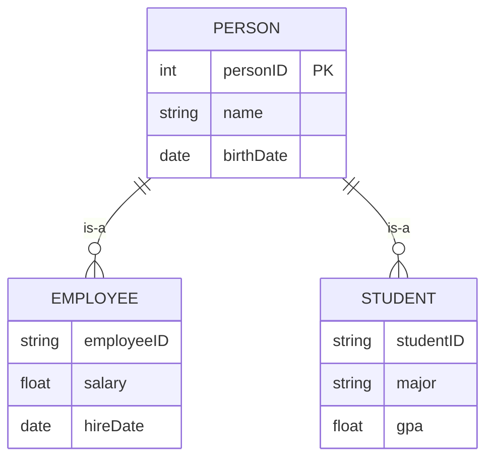
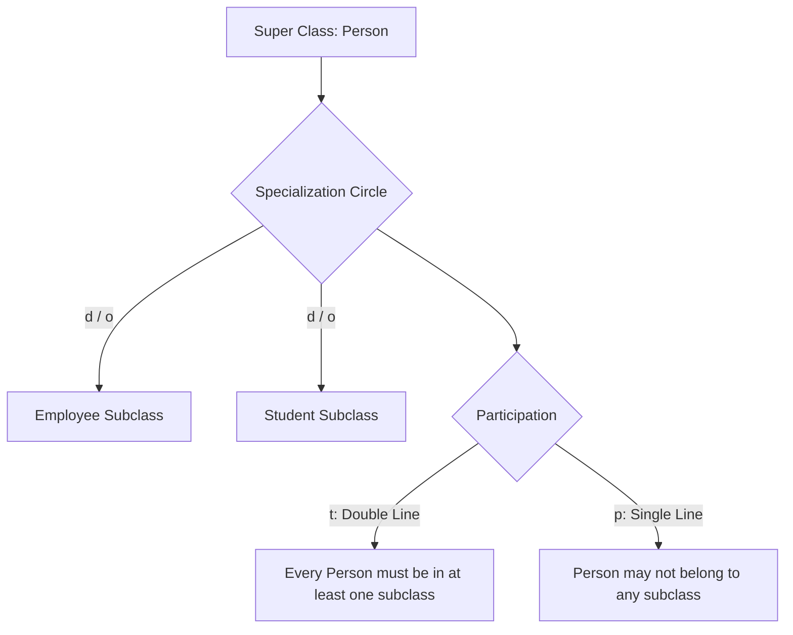
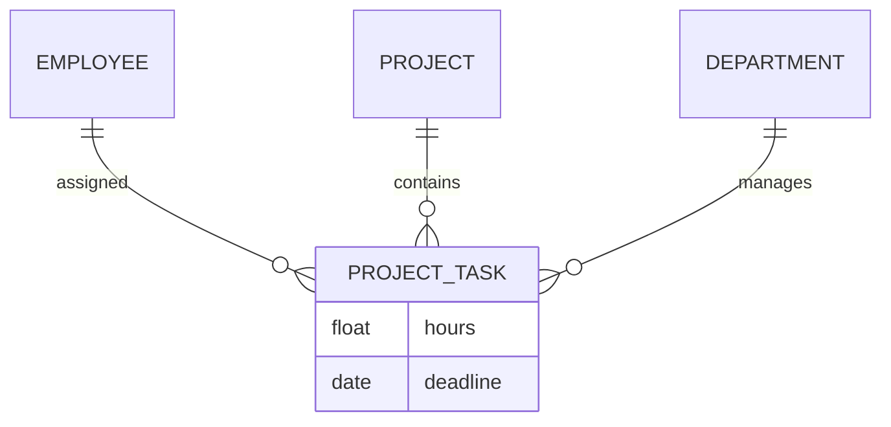
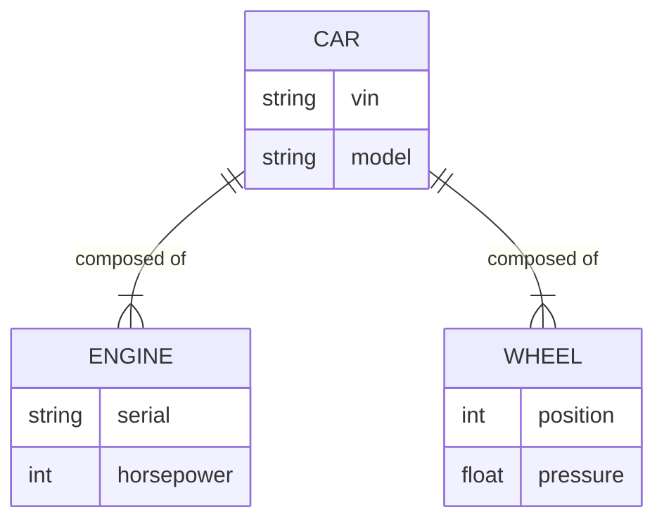

> [!ABSTRACT] Not-Syllabus Deep Dive
> - **Enhanced / Extended Entity-Relationship (EER)** modeling extends basic ER with inheritance, specialization, aggregation, and composition.
> These concepts are **not in the AL ICT syllabus**, but strengthen schema design and systems analysis skills.

---

## 1. Enhanced / Extended ER (EER) Overview

A basic [[Subtopics/System Analysis DFD & ER Modeling|ER Diagram]] captures entities, attributes, and relationships. **EER (Enhanced ER)** extends it with:

- **Specialization / Generalization** (inheritance hierarchies)
- **Inheritance Constraints** (disjoint vs. overlapping; total vs. partial)
- **Aggregation** (relationship as an entity)
- **Composition** (strong ownership / life dependency)

These allow modeling of complex real-world structures (e.g., `Person` → `Employee` / `Student`, or `Car` → `Engine`)

---

## 2. Specialization & Generalization

### 2.1 Definitions

| Concept | Meaning |
|:---|:---|
| **Specialization** | Defining **subclasses** from a **superclass** based on distinguishing characteristics (top-down). |
| **Generalization** | Combining **common features** of multiple entity sets into a **general superclass** (bottom-up). |

Both describe the same inheritance relationship; only the design direction differs.

### 2.2 Notation & Rules

- **Superclass** holds common attributes and relationships.
- **Subclass** inherits all superclass attributes and relationships, plus its own specific ones.
- A subclass participates in **all** relationships of its superclass.

> **Key Point**: `Employee` and `Student` are **subclasses** of `Person`. They inherit `name` and `birthDate` automatically.

---

## 3. Inheritance Constraints

Inheritance introduces two independent constraint pairs:

### 3.1 Disjoint vs. Overlapping

| Type | Symbol / Rule | Meaning |
|:---|:---|:---|
| **Disjoint** (`d`) | Subclass instances are **mutually exclusive**. A `Person` can be either `Employee` **or** `Student`, not both. | Usually drawn with a single circle labeled `d` |
| **Overlapping** (`o`) | Subclass instances **may overlap**. A `Person` can be both `Employee` **and** `Student`. | Drawn with `o` |

### 3.2 Total vs. Partial Participation

| Type | Symbol / Rule | Meaning |
|:---|:---|:---|
| **Total** (`t`) | Every superclass instance **must** belong to at least one subclass. | Double line from superclass to specialization circle |
| **Partial** (`p`) | A superclass instance **may** exist without belonging to any subclass. | Single line |

### 3.3 Constraint Combinations

> Example: If specialization is `(d, t)` → every `Person` is **exactly one** of `Employee`, `Student`, etc., with no overlap and no unclassified persons.
> If `(o, p)` → `Person` may be both `Employee` and `Student`, and may also be neither.

---

## 4. Aggregation

**Aggregation** treats a **relationship** as a higher-level entity so it can participate in other relationships.

- Notation: A diamond (relationship) enclosed in a **rectangle** (entity treatment).
- Common in scenarios like: `Employee` works on `Project` using `Task` — the `(Employee, Project, Task)` relationship itself may have attributes (`hoursWorked`) and relate to `Department`.

> **When to use**: When a relationship has its own independent existence and participates in further relationships.

---

## 5. Composition (Strong Aggregation / Ownership)

**Composition** is a stricter form of aggregation implying **life dependency**:

- If the **parent (whole)** is destroyed, the **child (part)** is also destroyed.
- The child cannot exist independently of the parent.
- Often modeled with a **filled diamond** (`◆`) instead of a hollow one (`◇`).

| Aspect | Aggregation (`◇`) | Composition (`◆`) |
|:---|:---|:---|
| Ownership | Weak / shared | Strong / exclusive |
| Life dependency | Child may outlive parent | Child dies with parent |
| Example | `Professor` — `Course` (professor can leave, course stays) | `Car` — `Engine` (engine has no meaning without car) |

---

## 6. Quick Reference Table

| EER Concept | Purpose | Key Symbol / Notation |
|:---|:---|:---|
| **Specialization** | Subclass creation (top-down) | Circle with lines to subclasses |
| **Generalization** | Superclass creation (bottom-up) | Same notation, design direction differs |
| **Inheritance** | Subclass gets superclass attributes & relationships | `is-a` relationship |
| **Disjoint (`d`)** | Subclasses are mutually exclusive | Label `d` |
| **Overlapping (`o`)** | Subclasses may overlap | Label `o` |
| **Total (`t`)** | Every parent must be in a subclass | Double line |
| **Partial (`p`)** | Parent may not be in any subclass | Single line |
| **Aggregation** | Relationship treated as entity | Diamond inside rectangle |
| **Composition** | Strong ownership / life dependency | Filled diamond (`◆`) |

---

:LiRocket: Flashcards (Spaced Repetition — Not in Syllabus)

#flashcards

What is the difference between Specialization and Generalization in EER? :: Specialization defines subclasses from a superclass (top-down); Generalization combines common features into a superclass (bottom-up). Both represent the same inheritance relationship.

What does a disjoint (`d`) inheritance constraint mean? :: Subclass instances are mutually exclusive. A superclass instance can belong to **at most one** subclass.

What does an overlapping (`o`) inheritance constraint allow? :: A superclass instance may belong to **more than one** subclass simultaneously.

What is the difference between total (`t`) and partial (`p`) participation in inheritance? :: Total means every superclass instance **must** belong to at least one subclass (double line). Partial means a superclass instance **may** exist without belonging to any subclass (single line).

When should Aggregation be used in EER? :: When a relationship needs to be treated as an entity so it can participate in other relationships (e.g., `Project_Task` relating to `Department`).

What distinguishes Composition (`◆`) from Aggregation (`◇`)? :: Composition implies **strong ownership and life dependency** — the child cannot exist without the parent (e.g., `Engine` without `Car`). Aggregation implies weaker shared association.
