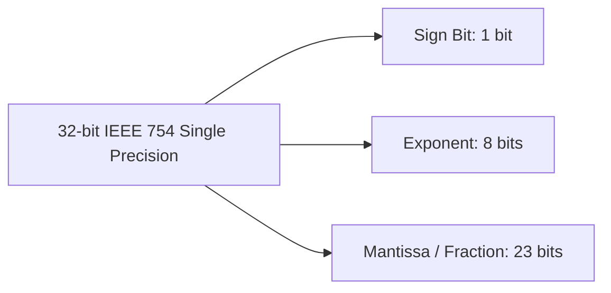
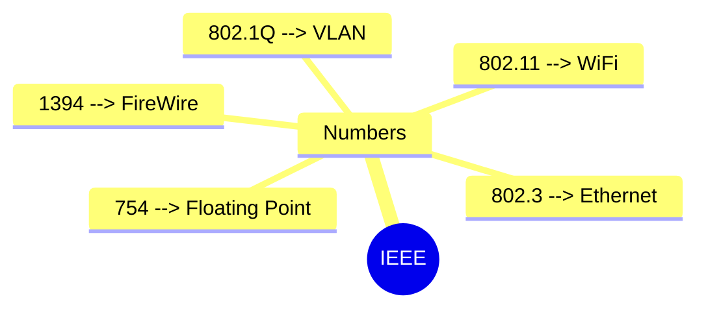

> [!ABSTRACT] Not-Syllabus Deep Dive
> Brief reference on major **IEEE (Institute of Electrical and Electronics Engineers)** standards used in computing and networking — not required for exams, but important for technical literacy.

---

## 1. What is IEEE?

- **IEEE** = Institute of Electrical and Electronics Engineers.
- Global technical organization that develops and publishes standards for electronics, computing, telecommunications, and more.
- Standards are identified by number: `IEEE 754`, `IEEE 802.11`, etc.

---

## 2. IEEE 754 — Floating-Point Arithmetic

Defines how real numbers are represented in binary for computers.

### 2.1 Basic Structure

A floating-point number = **Sign** × **Significand (Mantissa)** × $2^{\text{Exponent}}$.

| Component | Bits (32-bit) | Purpose |
|:---|:---|:---|
| **Sign** | 1 | `0` = positive; `1` = negative |
| **Exponent** | 8 | Determines scale (biased by 127) |
| **Mantissa** | 23 | Represents significant digits |

### 2.2 Special Values

| Representation | Meaning |
|:---|:---|
| Exponent all 0s, Mantissa non-zero | **Subnormal / Denormalized** numbers (very small) |
| Exponent all 1s (`255`), Mantissa 0 | **Infinity** (`±∞`) |
| Exponent all 1s (`255`), Mantissa non-zero | **NaN** (Not a Number) |

> [!INFO] Why it matters
> Without IEEE 754, every computer architecture might store floats differently, making cross-platform numerical computation unreliable.

### 2.3 Example Sums (IEEE 754 Addition)

**Example 1 — Adding numbers with different exponents**

Add $5.5 + 1.75$ (simplified binary float logic):

- $5.5 = 1.011 \times 2^2$
- $1.75 = 1.11 \times 2^0$

**Step 1:** Align exponents (shift smaller exponent up):
- $1.75 = 0.0111 \times 2^2$

**Step 2:** Add mantissas:
- $1.011 + 0.0111 = 1.1101 \times 2^2$
- Result $≈ 7.3125$

> The key idea: **exponents must match** before mantissas can be added.

---

**Example 2 — Normalization after addition**

Add $3.0 + 6.0$:

- $3.0 = 1.1 \times 2^1$
- $6.0 = 1.1 \times 2^2$ (shifted: $0.11 \times 2^2$ or re-align differently)

Simpler alignment (use $2^2$):
- $3.0 = 0.11 \times 2^2$
- $6.0 = 1.10 \times 2^2$

Add:
- $0.11 + 1.10 = 10.01 \times 2^2$

**Normalize** (shift mantissa left, adjust exponent):
- $10.01 \times 2^2 = 1.001 \times 2^3$
- Result = $9.0$ (binary $1001$), which matches $3 + 6$.

> **Takeaway:** After addition, if the mantissa overflows (`10.`), shift left and **increment the exponent** to keep the format valid.

---

## 3. IEEE 802.11 — Wireless LAN (Wi-Fi)

The family of standards for wireless local area networking — commonly called **Wi-Fi**.

| Standard | Common Name | Frequency | Max Theoretical Speed | Notes |
|:---|:---|:---|:---|:---|
| **802.11b** | — | 2.4 GHz | 11 Mbps | Early standard; prone to interference |
| **802.11g** | — | 2.4 GHz | 54 Mbps | Backward compatible with `b` |
| **802.11n** (Wi-Fi 4) | — | 2.4 / 5 GHz | 600 Mbps | MIMO technology |
| **802.11ac** (Wi-Fi 5) | — | 5 GHz | ~6.9 Gbps | Very high throughput |
| **802.11ax** (Wi-Fi 6 / 6E) | — | 2.4 / 5 / 6 GHz | ~9.6 Gbps | Better efficiency, lower latency |

> Key point: The **Wi-Fi Alliance** certifies products as interoperable; the underlying specs are IEEE 802.11.

---

## 4. Other Notable IEEE Standards (Quick Reference)

| Standard | Domain | Description |
|:---|:---|:---|
| **IEEE 802.3** | Networking | **Ethernet** (wired LAN) — defines MAC, PHY, cabling |
| **IEEE 802.1Q** | Networking | VLAN tagging for Ethernet networks |
| **IEEE 1394** | Hardware / I/O | **FireWire** (high-speed serial bus for audio/video devices) |
| **IEEE 488** | Instrumentation | **GPIB** (General Purpose Interface Bus) — connects test instruments |
| **IEEE 1003.1** | Software | **POSIX** — portable operating system interface (Unix/Linux compatibility) |
| **IEEE 802.15** | Networking | Personal Area Networks (**Bluetooth**, Zigbee, etc.) |

---

## 5. Quick Memory Aid

---

:LiRocket: Flashcards (Spaced Repetition — Not in Syllabus)

#flashcards

What does IEEE stand for? :: Institute of Electrical and Electronics Engineers — a global standards organization.

What is the purpose of IEEE 754? :: It defines how floating-point numbers are represented in binary (sign, exponent, mantissa) for consistent computation across systems.

How many bits for the exponent in 32-bit IEEE 754 single precision? :: 8 bits (biased by 127).

What does IEEE 802.11 refer to? :: The family of wireless LAN (Wi-Fi) standards.

What is the common name for IEEE 802.3? :: Ethernet (wired local area network standard).

What is IEEE 1394 better known as? :: FireWire (high-speed serial bus for peripherals and media devices).
