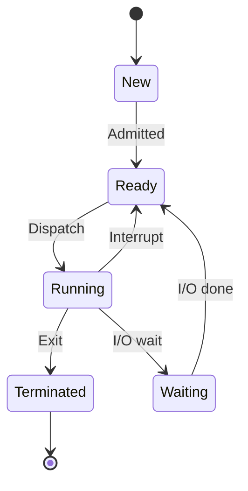
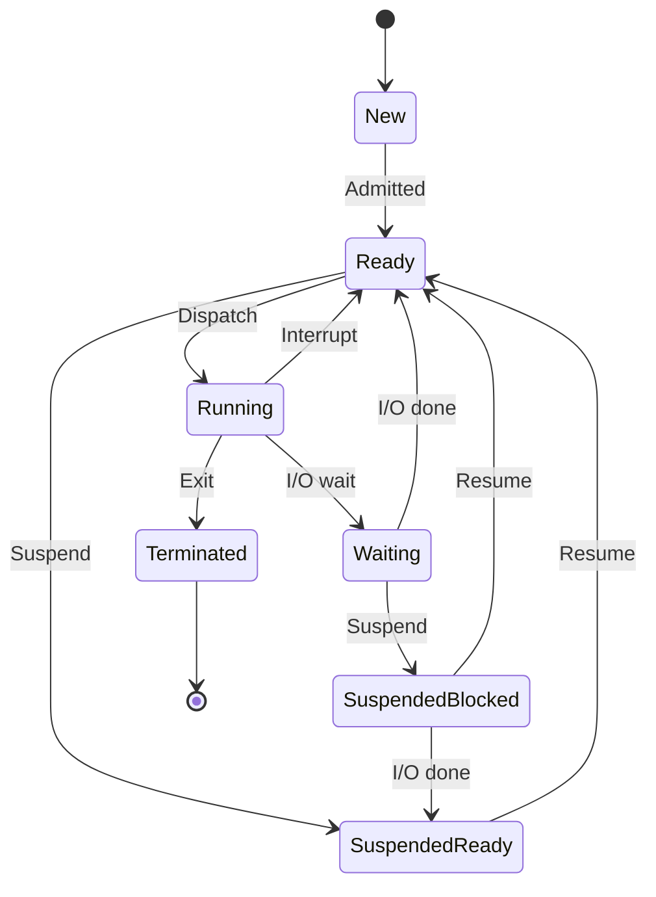
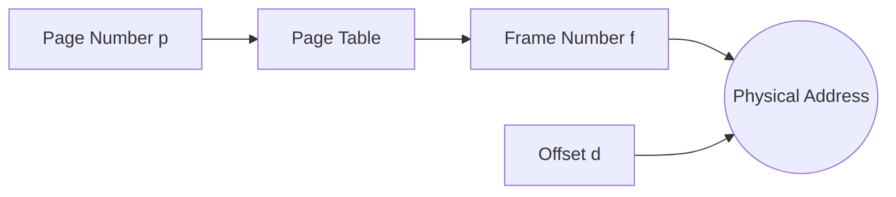
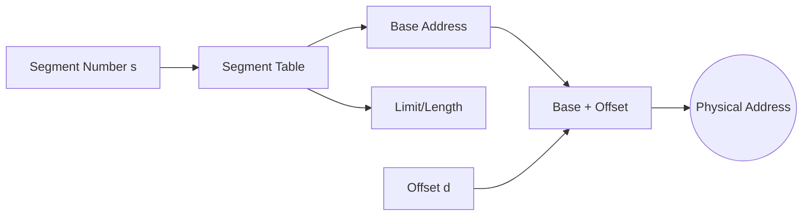

# :LiSettings: Subtopic: OS Process & Memory Management

> [!ABSTRACT] Core Focus
> Process Control Block (PCB), 5-state + 7-state models, interrupts, schedulers (long/medium/short + FCFS/SJF/RR Gantt charts), Paging, Segmentation, Virtual Memory, file allocation, MMU, drivers/spooling. Sections marked Extension are beyond NIE 5.1-5.4.

---
## 1. Process Control Block (PCB)

The OS stores information about each active process in a **Process Control Block (PCB)** containing:
- **Process ID (PID)**
- **Process State** (New, Ready, Running, Waiting, Terminated)
- **Program Counter (PC)**: Next instruction address
- **CPU Registers** (Accumulators, index registers)
- **Memory Allocation Pointers** (Page tables, segment tables)
- **I/O Status Information** (Allocated devices, open files)

---
## 2. Process 5-State Transition Diagram

### 2b. Seven-State Model (syllabus)

Medium-term scheduler swaps processes to disk to control multiprogramming. Adds `Suspended Ready` and `Suspended Blocked`.

### 2c. Interrupts, Creation & Schedulers (syllabus)

- **Process vs Program**: program = static code; process = execution with PID/context.
- **Types**: I/O-bound vs CPU-bound. Needs PID, code, data, context.
- **Creation**: new batch job, user starts program, OS service, child spawn. OS assigns PID/PCB/memory, queues Ready.
- **Termination**: normal exit, time-limit, resource unavailable, error/memory violation, OS/parent kill. OS reclaims resources.
- **Interrupts**: async event (timer, I/O done) altering sequence. OS saves state to PCB, runs another, restores on completion.
- **Schedulers**: Long-term (job, admit, slowest, degree of multiprogramming) / Medium-term (swapping, middle) / Short-term (CPU dispatcher, fastest).

---
## 3. CPU Scheduling Algorithms & Gantt Chart Example

Consider processes $P_1$ (Burst: 6ms), $P_2$ (Burst: 2ms), $P_3$ (Burst: 1ms) arriving at time $t=0$.

### A. FCFS (First-Come First-Served):
Gantt Chart: 

```mermaid
gantt
    title FCFS CPU Scheduling
    dateFormat X
    axisFormat %s ms
    section Tasks
    P1 : active, p1, 0, 6
    P2 : p2, after p1, 2
    P3 : p3, after p2, 1
```

- Waiting Time: $P_1 = 0$, $P_2 = 6$, $P_3 = 8$.
- **Average Waiting Time**: $(0 + 6 + 8) / 3 = 4.67\text{ ms}$.

### B. SJF (Shortest Job First):
Gantt Chart: 

``` mermaid
gantt
    title SJF CPU Scheduling
    dateFormat X
    axisFormat %s ms
    section Tasks
    P3 : active, p3, 0, 1
    P2 : p2, after p3, 2
    P1 : p1, after p2, 6
```

- Waiting Time: $P_3 = 0$, $P_2 = 1$, $P_1 = 3$.
- **Average Waiting Time**: $(0 + 1 + 3) / 3 = 1.33\text{ ms}$.

---
## 4. CPU Scheduling Algorithms (Continued)

### C. Round Robin (RR) — Quantum = 2ms:
Gantt Chart:

``` mermaid
gantt
    title Round Robin CPU Scheduling (q=2ms)
    dateFormat X
    axisFormat %s ms
    section Tasks
    P1 : active, p1_1, 0, 2
    P2 : p2_1, after p1_1, 2
    P3 : p3_1, after p2_1, 1
    P1 : p1_2, after p3_1, 2
    P1 : p1_3, after p1_2, 2
```

- Waiting Time: $P_1 = 3$, $P_2 = 2$, $P_3 = 4$.
- **Average Waiting Time**: $(3 + 2 + 4) / 3 = 3.00\text{ ms}$.

### D. Priority Scheduling (Lower number = Higher priority):
Assume $P_1$ (Priority 3), $P_2$ (Priority 1), $P_3$ (Priority 2).
Gantt Chart:

``` mermaid
gantt
    title Priority CPU Scheduling
    dateFormat X
    axisFormat %s ms
    section Tasks
    P2 : active, p2, 0, 2
    P3 : p3, after p2, 1
    P1 : p1, after p3, 6
```

- Waiting Time: $P_2 = 0$, $P_3 = 2$, $P_1 = 3$.
- **Average Waiting Time**: $(0 + 2 + 3) / 3 = 1.67\text{ ms}$.

### E. Key Metrics:
| Metric | Formula |
|--------|---------|
| **Turnaround Time** | Completion Time - Arrival Time |
| **Waiting Time** | Turnaround Time - Burst Time |
| **Response Time** | First CPU Start - Arrival Time |

### F. Preemptive vs Non-Preemptive:
- **Preemptive**: OS can interrupt running process (RR, Preemptive SJF/Priority).
- **Non-Preemptive**: Process runs to completion/block (FCFS, Non-preemptive SJF/Priority).

---
## 5. Process Synchronization (Extension — beyond NIE 5.3)

### Critical Section Problem:
Requirements: **Mutual Exclusion**, **Progress**, **Bounded Waiting**.

### Synchronization Tools:
- **Mutex Lock**: Binary lock (acquire/release).
- **Semaphore**: Integer variable with `wait()` (P) and `signal()` (V) operations.
  - *Counting Semaphore*: Multiple resources.
  - *Binary Semaphore*: Mutex equivalent (0 or 1).
- **Monitor**: High-level construct with condition variables (`wait`, `signal`).

### Classic Problems:
- **Producer-Consumer** (Bounded Buffer)
- **Readers-Writers**
- **Dining Philosophers**

---
## 6. Deadlocks (Extension — beyond NIE 5.3)

### Necessary Conditions (Coffman):
1. **Mutual Exclusion**
2. **Hold and Wait**
3. **No Preemption**
4. **Circular Wait**

### Handling Strategies:
- **Prevention**: Negate one condition (e.g., request all resources at once).
- **Avoidance**: Banker's Algorithm (safe state detection).
- **Detection & Recovery**: Resource-allocation graph + rollback/kill.
- **Ignorance**: Ostrich algorithm (most OSs).

---
## 7. Memory Management

### Memory Allocation Schemes:
| Scheme | Description | Fragmentation |
|--------|-------------|---------------|
| **Contiguous** | Single partition per process | External |
| **Fixed Partitioning** | Pre-defined partitions | Internal |
| **Dynamic Partitioning** | Partitions created at load time | External |
| **Paging** | Fixed-size pages/frames | Internal only |
| **Segmentation** | Variable-size segments (logical units) | External |
| **Segmented Paging** | Segments divided into pages | Internal only |

### Allocation Algorithms (Dynamic Partitioning):
- **First-Fit**: First hole large enough.
- **Best-Fit**: Smallest sufficient hole.
- **Worst-Fit**: Largest hole.

### Fragmentation:
- **Internal**: Wasted space within allocated block (Paging).
- **External**: Free memory scattered in small blocks (Segmentation, Dynamic Partitioning).
- **Compaction**: Shuffle memory to combine free space (requires dynamic relocation).

### Paging Architecture:
Logical address divided into **Page Number ($p$)** and **Page Offset ($d$)**. **Frame** = fixed-size block of physical RAM; **Page** = same-size block of logical memory. Frames 512B–8KB, same size as pages. OS keeps free-frame list, builds page table.

---
## 8. Segmentation

Logical address = **Segment Number ($s$)** + **Offset ($d$)**.

- Segment Table entry: **Base** (start physical address) + **Limit** (length).
- Protection bits: Read/Write/Execute per segment.
- Supports sharing (code segments) and dynamic growth (stack/heap).

---
## 9. Virtual Memory

### Demand Paging (recap):
- Pages loaded only when needed.
- **Page Fault** rate critical for performance.

### MMU Mapping, Drivers & Spooling (syllabus 5.4)

- **MMU**: hardware virtual->physical. Base + offset, e.g. base `10000` + user `100` = `10100`.
- **Mapping**: OS maps at allocation; MMU translates at runtime. Goals of virtual memory: larger-than-RAM apps, partial load, higher multiprogramming, portability, sharing.
- **Device driver**: software interface to hardware, depends on hardware + OS; install per peripheral.
- **Spooling (Simultaneous Peripheral Operations On-Line)**: disk/memory buffer for slow I/O, overlaps I/O with CPU, disk as large buffer.
- **File allocation** (syllabus 5.2): Contiguous (adjacent, simple, external frag) / Linked (FAT example, links, many seeks) / Indexed (UNIX example, index table).

### Page Replacement Algorithms (Extension — beyond NIE 5.4):
Reference string: 1, 2, 3, 4, 1, 2, 5, 1, 2, 3, 4, 5 (3 frames)

| Algorithm | Page Faults | Description |
|-----------|-------------|-------------|
| **FIFO** | 9 | Replace oldest page |
| **Optimal (OPT)** | 7 | Replace page used farthest in future |
| **LRU** | 8 | Replace least recently used |
| **Clock (Second Chance)** | ~8 | FIFO with reference bit |

### Belady's Anomaly:
FIFO can have **more page faults with more frames**.

### Thrashing:
- Process spends more time paging than executing.
- Cause: **Sum of working sets > Physical memory**.
- Solution: **Working Set Model**, **Page Fault Frequency (PFF)** control, **Swap out** processes.

### Working Set Model:
- Set of pages referenced in last $\Delta$ time window.
- Keep working set in memory to prevent thrashing.

---
## 10. Summary Cheat Sheet

| Topic | Key Points |
|-------|------------|
| **PCB** | PID, State, PC, Registers, Memory ptrs, I/O info |
| **5 States** | New -> Ready <-> Running <-> Waiting -> Terminated |
| **7 States** | + Suspended Ready, Suspended Blocked (medium-term swapping) |
| **Scheduling** | FCFS, SJF, RR, Priority (Preemptive/Non-preemptive) |
| **Metrics** | Turnaround, Waiting, Response Time |
| **Sync** | Mutex, Semaphore, Monitor; Producer-Consumer, Readers-Writers |
| **Deadlock** | 4 Conditions; Prevention, Avoidance (Banker's), Detection |
| **Memory** | Contiguous, Paging, Segmentation, Segmented Paging |
| **Allocation** | First/Best/Worst Fit |
| **Virtual Mem** | Demand Paging, Page Fault, Replacement (FIFO, LRU, OPT), Thrashing |
| **Replacement** | LRU $\approx$ OPT; FIFO suffers Belady's Anomaly |