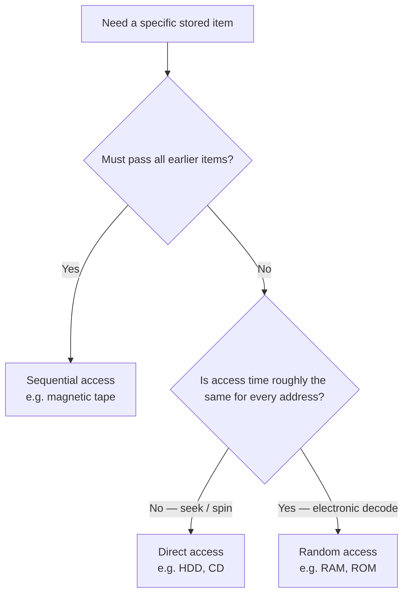

# :LiHardDrive: Subtopic: Sequential, Direct & Random Access

> [!ABSTRACT] Core Focus
> How data is **located and retrieved** on storage media. Exam trap: **direct access ≠ random access**. Sequential = must pass earlier items. Direct = jump to an address, time still varies. Random = any address in (almost) equal time.

> [!INFO] Where this sits
> Complements [[Lesson 02 - Evolution of Computing Devices|Lesson 02]] (memory hierarchy / secondary storage) and [[Lesson 05 - Operating Systems|Lesson 05]] (file management). Not the same as CPU-cache “sequential access” in the CS notes.

---

## 1. Sequential Access (also called serial access)

**Definition:** Data is stored and retrieved **in a fixed linear order**. To reach the $n$th record (or block), the device **must pass over the previous $n-1$ items**. You cannot jump to an arbitrary location. Access time **depends on where the item sits** relative to the current position of the read/write mechanism.

**What that means in practice:**
- Next item is cheap; an item in the middle or at the far end is slow.
- Best when you will process **the whole file from start to finish** (backup, batch payroll, log replay).
- Worst when you need **one record out of millions**.

**Examples:**
- **Magnetic tape** (backup LTO, old reel tape) — the classic sequential medium. To read the 500th file you wind past 1–499.
- **Cassette / VHS** — same idea: rewind/fast-forward through earlier content.
- A **sequential file** on disk that is only scanned from the first record to the last (the *method* is sequential even if the *device* could do otherwise).

---

## 2. Direct Access

**Definition:** Each stored item (or block) has a **known address** (e.g. cylinder / track / sector on a disk). The system **computes that address and moves the read/write mechanism there** without reading every intervening record. Access time is **not constant**: it still includes **seek time** (head movement) and **rotational latency** (waiting for the right sector to spin under the head).

**What that means in practice:**
- You *can* go to record 500 without reading 1–499.
- Record 2 and record 2,000,000 do **not** take the same time — distance and spin matter.
- This is why disks are called **DASD** (Direct Access Storage Devices) in older textbooks.

**Examples:**
- **Hard disk drive (HDD)** — address = platter + cylinder + track + sector. Head seeks, platter rotates, then the sector is read.
- **Optical disc (CD / DVD / Blu-ray)** — laser jumps to a track; still a physical seek, not uniform time.
- **Indexed / hashed files on disk** — OS/DBMS maps a key to a block address, then the disk does a direct access to that block.

---

## 3. Random Access

**Definition:** Any addressable location can be selected **independently of the previous location**, and the time to read/write it is **(approximately) the same for every address**. Access time does **not** grow with “how far” the location is, because there is no mechanical winding or seeking through other cells.

**What that means in practice:**
- Location `0x0000` and location `0xFFFF` cost the same (for a given memory chip).
- This is the defining property of **RAM** — *Random Access Memory* — and of other semiconductor memories with a decoded address.

**Examples:**
- **DRAM / SRAM (main memory and cache)** — row/column (or similar) decode; roughly uniform access.
- **ROM / flash used as memory-mapped storage** (BIOS chip, microcontroller program memory).
- **SSD** is *electrically* addressed (no arm, no spin), so access is much closer to random than an HDD. For A/L, still treat **RAM as the textbook random-access device**; SSD is secondary storage with near-uniform access, not a DASD in the HDD sense.

---

## 4. Side-by-side (exam table)

| | **Sequential** | **Direct** | **Random** |
| :--- | :--- | :--- | :--- |
| How you reach item $n$ | Pass items $1 \ldots n-1$ | Compute address, move mechanism there | Decode address; go straight to the cell |
| Must read earlier items? | **Yes** | **No** | **No** |
| Access time | Depends strongly on position | Varies (seek + rotation) | **≈ constant** |
| Typical media | Magnetic tape, cassette | HDD, CD/DVD | RAM, ROM (SSD ≈ this class) |
| Good for | Full-file scan, backups | One file/record on disk | Instructions & data in main memory |

> [!WARNING] Direct vs random (the usual MCQ trap)
> Both skip intermediate records. **Direct** still has **variable** mechanical delay. **Random** has **uniform** electronic delay. Calling a hard disk “random access” is sloppy; the precise term is **direct access**. Calling RAM “direct access” is also sloppy; RAM is **random access**.

---

## :LiRocket: Flashcards (Spaced Repetition)

#flashcards

Define sequential (serial) access. :: Data is retrieved in a fixed linear order; to reach the nth item the device must pass over the previous n−1 items. Access time depends on position. Example: magnetic tape.

Define direct access. :: An item is reached by computing its storage address and moving the read/write mechanism there without reading intervening records. Access time is not constant (seek + rotational latency). Example: HDD, CD/DVD.
<!--SR:!2026-09-26,1,230-->

Define random access. :: Any addressable location can be selected independently, with approximately equal access time for every address. Example: RAM (also ROM).

Why is a hard disk direct access but not random access? :: The disk can jump to a sector by address (direct), but time still depends on seek and rotation, so it is not uniform (not random).
<!--SR:!2026-09-29,4,270-->

Why is RAM called random access memory? :: Any memory cell can be read or written in approximately the same time, independent of address and of the previous access.

Give one example medium for sequential, direct, and random access. :: Sequential: magnetic tape. Direct: HDD (or CD/DVD). Random: RAM.
