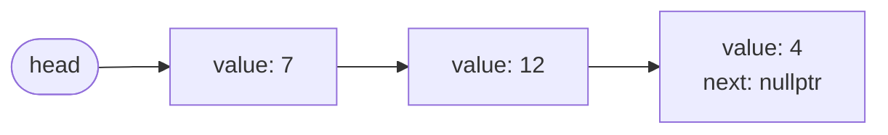
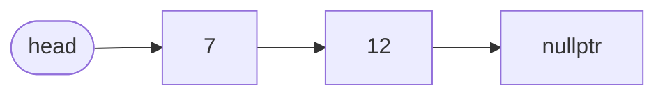
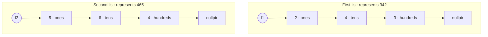
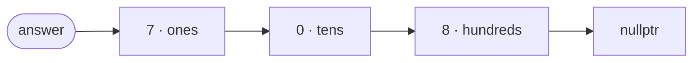

---
# :LiBook: Lesson 15: Linked Lists & Pointers

> [!ABSTRACT] Scope
> A linked list is a sequence made of separate objects called **nodes**. Each node stores a value and the location of the next node. This is a foundational CS idea; in most contests, `vector` is still the better default.

---
## 1. Why Not Just Use an Array?

A `vector` stores its elements next to each other in memory, so `a[i]` is fast: $O(1)$.

A linked list stores each value in a separate node. To reach the third node, start at the first node and follow two links. Therefore, accessing position $i$ takes $O(i)$, and can take $O(n)$ overall.



Each arrow is a **pointer**: it stores the address of another object. `nullptr` means “there is no next node.”

---
## 2. The Node Structure

```cpp
struct Node {
    int value;
    Node* next;

    Node(int value) : value(value), next(nullptr) {}
};
```

- `Node* next` means “a pointer to a `Node`.”
- `Node* head` points to the first node.
- An empty list has `head == nullptr`.


---
## 3. Traversing a List

```cpp
void printList(Node* head) {
    for (Node* current = head; current != nullptr; current = current->next) {
        cout << current->value << ' ';
    }
    cout << '\n';
}
```

Read `current->value` as “the `value` inside the node that `current` points to.” It is shorthand for `(*current).value`.

The loop visits every node once, so its time complexity is $O(n)$.

---
## 4. Insert at the Front

```cpp
void pushFront(Node*& head, int value) {
    Node* newNode = new Node(value);
    newNode->next = head;
    head = newNode;
}
```

Suppose the list is



To insert `3` at the front:

1. Create `[3]`.
2. Make `[3].next` point to the old `head` (`[7]`).
3. Move `head` to `[3]`.

This is $O(1)$ because no existing nodes need to move.

`Node*& head` means this function receives a **reference to the head pointer**, so changing `head` inside the function also changes the caller's `head`.

---
## 5. Worked Example: Add Two Numbers

> [!QUESTION] Problem
> Two non-empty linked lists represent two non-negative integers. Each node holds one digit, and the digits are stored in **reverse order**. Add the numbers and return their sum as a linked list in the same order.

For example, `[2 -> 4 -> 3]` means $342$, not $243$: the first node is the ones digit.



Add corresponding digits exactly as you do on paper, carrying to the next position:

| Position | Calculation | New digit | Carry forward |
| :--- | :--- | :---: | :---: |
| ones | $2 + 5 + 0 = 7$ | $7$ | $0$ |
| tens | $4 + 6 + 0 = 10$ | $0$ | $1$ |
| hundreds | $3 + 4 + 1 = 8$ | $8$ | $0$ |

So $342 + 465 = 807$, and the result must store its digits in reverse order:



### Algorithm

At every step:

1. Read the current digit from each list; use $0$ if that list is already finished.
2. Compute `sum = digit1 + digit2 + carry`.
3. Append a node containing `sum % 10`.
4. Set `carry = sum / 10`.
5. Move each available list pointer forward.

Continue while there is a node left in either list **or** a final carry remains. That final carry matters: for example, $999 + 1 = 1000$.

```cpp
class Solution {
public:
    ListNode* addTwoNumbers(ListNode* l1, ListNode* l2) {
        ListNode dummy(0);              // stable node before the answer's first node
        ListNode* tail = &dummy;
        int carry = 0;

        while (l1 != nullptr || l2 != nullptr || carry != 0) {
            int digit1 = (l1 != nullptr) ? l1->val : 0;
            int digit2 = (l2 != nullptr) ? l2->val : 0;
            int sum = digit1 + digit2 + carry;

            carry = sum / 10;
            tail->next = new ListNode(sum % 10);
            tail = tail->next;

            if (l1 != nullptr) l1 = l1->next;
            if (l2 != nullptr) l2 = l2->next;
        }

        return dummy.next;
    }
};
```

The dummy node avoids a special case for creating the first answer node. The algorithm visits each input node at most once:

$$
\text{time}=O(\max(m,n)),\qquad
\text{extra nodes in the answer}=O(\max(m,n)).
$$

---

## 6. Cleaning Up Memory

`new Node(...)` reserves memory. Every allocated node must eventually be deleted.

```cpp
void deleteList(Node*& head) {
    while (head != nullptr) {
        Node* oldHead = head;
        head = head->next;
        delete oldHead;
    }
}
```

For the beginning, use this manual version only to understand the structure. In real modern C++ code, smart pointers and standard containers are safer. For contest problems, prefer `vector`, `deque`, `queue`, or `stack` unless the problem specifically needs a linked-list operation.

---
## 7. When Is a Linked List Useful?

| Operation | Linked list with a known node | `vector` |
| :--- | :---: | :---: |
| Read element at index $i$ | $O(n)$ | $O(1)$ |
| Insert/remove at front | $O(1)$ | often $O(n)$ |
| Insert after a known node | $O(1)$ | often $O(n)$ |
| Cache-friendly iteration | usually worse | usually better |

> [!TIP] Contest rule of thumb
> Start with `vector`. A linked list is mainly useful when you already have the node/iterator where an insertion or deletion must happen. Learn the idea well, but do not force it into problems.

---
## :LiRocket: Flashcards (Spaced Repetition)

#flashcards

What does a node in a singly linked list store? :: A value and a pointer to the next node.

What does `nullptr` mean in a linked list? :: The pointer points to no node; it marks an empty list or the end of a list.

Why does reading the element at index $i$ of a linked list take $O(i)$ time? :: The program must start at the head and follow links one by one to reach it.

What does `current->value` mean? :: Access the `value` member of the node that `current` points to.

Which container is usually the default choice in programming contests? :: `vector`, unless a problem specifically benefits from a different structure.

Why does the add-two-numbers linked-list algorithm continue while `carry != 0`? :: Addition may produce a final new digit, such as $999 + 1 = 1000$.
