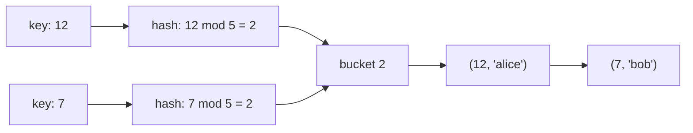

---
# :LiBook: Lesson 16: Hash Tables & Hash Maps

> [!ABSTRACT] Scope
> A hash table stores key–value pairs and aims to find a value by its key in average $O(1)$ time. In C++, its usual form is `unordered_map<Key, Value>`.

---
## 1. The Main Idea

A hash function turns a key into a bucket index. For example, a simplified table of size $5$ might use

$$
\text{bucket}(x)=x\bmod5.
$$



The keys `12` and `7` land in the same bucket. This is a **collision**. A hash table must handle collisions correctly; one common method stores a small list of entries in each bucket, as shown above.

---
## 2. Why Is It Fast?

Instead of checking every key, the table computes a bucket directly and searches only that bucket.

- With a good hash function and enough buckets, buckets stay small on average.
- So insertion, lookup, and deletion are average $O(1)$.
- In a bad worst case—many keys collide—an operation can become $O(n)$.

The **load factor** is roughly

$$
\text{load factor}=\frac{\text{number of stored keys}}{\text{number of buckets}}.
$$

When it grows too large, implementations usually create a bigger bucket array and rehash the entries. That occasional expensive operation is why insertion is described as *average* or *amortised* $O(1)$.

---
## 3. C++: `unordered_map`

```cpp
unordered_map<string, int> score;
score["Nimal"] = 10;
score["Asha"] += 5;             // creates "Asha" with value 0, then adds 5

if (score.contains("Nimal")) {  // C++20
    cout << score["Nimal"] << '\n';
}

for (const auto& [name, points] : score) {
    cout << name << ": " << points << '\n';
}
```

Important: `mp[key]` inserts a new key with a default value if it is missing. Use `find` or `contains` when you only want to check whether a key exists.

```cpp
auto it = score.find("Kamal");
if (it != score.end()) {
    cout << it->second << '\n';
}
```

---
## 4. `unordered_map` vs `map`

| Property | `unordered_map` | `map` |
| :--- | :--- | :--- |
| Underlying idea | hash table | balanced binary search tree |
| Typical lookup/insert | average $O(1)$ | $O(\log n)$ |
| Key iteration order | arbitrary | sorted by key |
| Supports nearest / range key queries | no | yes |
| Worst-case lookup | $O(n)$ | $O(\log n)$ |

Use `unordered_map` for quick counting, memoisation, and direct lookups. Use `map` when you need keys in sorted order or operations such as “first key at least `x`.”

---
## 5. Contest Notes

- Frequency counting: `unordered_map<int, int> freq;`.
- Compress large values to indices when ordering or array speed matters.
- Do not rely on iteration order from an `unordered_map`.
- For adversarial inputs, hash tables can sometimes be forced into many collisions. `map` is a reliable $O(\log n)$ fallback.

> [!TIP] Mental model
> A hash map is not “a magical array indexed by anything.” It is an array of buckets plus a rule for mapping keys to buckets. Understanding collisions explains both its speed and its limitations.

---
## :LiRocket: Flashcards (Spaced Repetition)

#flashcards

What does a hash function do in a hash table? :: It maps a key to a bucket where that key–value pair should be stored or searched for.

What is a collision? :: Two different keys produce the same bucket index.

What is the typical time complexity of `unordered_map` lookup? :: Average $O(1)$, though worst-case $O(n)$ is possible.

When should you choose `map` over `unordered_map`? :: When keys must remain sorted or when you need ordered/range key operations.

Why can `mp[key]` be surprising in C++? :: It inserts `key` with a default value if the key does not already exist.
